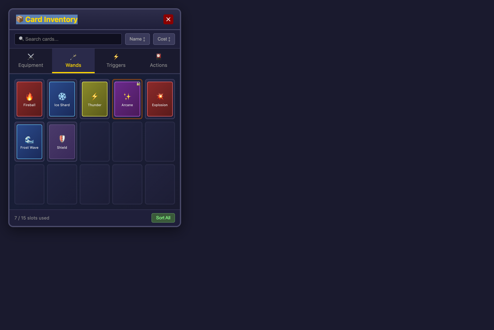

# Card Inventory Grid Specification

**Status**: Approved  
**Created**: 2026-01-11

## Overview

A tabbed inventory panel that replaces the world-space card rendering with a proper UI-based grid system. Players can organize cards across 4 categories, drag between slots, filter/sort, and lock important cards.

## Visual Mockup



## Layout Structure

```
dsl.root (main panel)
├── dsl.spritePanel (header)
│   └── dsl.hbox
│       ├── dsl.text ("Card Inventory")
│       └── dsl.button (close "✕")
├── dsl.hbox (filter bar)
│   ├── dsl.inputText (search)
│   ├── dsl.button ("Name ↕")
│   └── dsl.button ("Cost ↕")
├── dsl.tabs
│   ├── Tab: Equipment → dsl.inventoryGrid
│   ├── Tab: Wands → dsl.inventoryGrid
│   ├── Tab: Triggers → dsl.inventoryGrid
│   └── Tab: Actions → dsl.inventoryGrid
└── dsl.hbox (footer)
    ├── dsl.dynamicText (slot count)
    └── dsl.button ("Sort All")
```

## Components Used

| Component | Purpose | Config |
|-----------|---------|--------|
| `dsl.root` | Main container | `color: "blackberry", emboss: 3, padding: 0` |
| `dsl.spritePanel` | Header background | `sprite: "ui-panel-header.png", borders: {8,8,8,8}` |
| `dsl.tabs` | Category switching | `id: "inventory_tabs", activeTab: "equipment"` |
| `dsl.inventoryGrid` | Card slot grid | `rows: 3, cols: 5, slotSize: 64, slotGap: 6` |
| `dsl.text` | Title | `fontSize: 18, color: "gold", shadow: true` |
| `dsl.button` | Actions | `hover: true, onClick: handler` |
| `dsl.dynamicText` | Slot counter | Updates on inventory change |
| `dsl.hbox` | Horizontal layouts | Filter bar, footer |

## Interactive Behavior

| Interaction | Behavior |
|-------------|----------|
| **Drag card** | Pick up card from slot, drag to empty slot in same tab, drop to move |
| **Hover card** | Show tooltip with card name, type, element, stats, description |
| **Click sort button** | Reorder visible cards by name or mana cost (toggle asc/desc) |
| **Type in search** | Filter cards whose name contains search text (case-insensitive) |
| **Click tab** | Switch to that category's grid, preserve other tab states |
| **Right-click card** | Toggle lock state (locked cards show 🔒, can't be moved) |
| **Click close (✕)** | Hide inventory panel, emit `inventory_closed` signal |
| **Press 'I' key** | Toggle inventory panel visibility |

## Data Bindings

| Element | Source |
|---------|--------|
| Title text | `localization.get("ui.inventory.title")` |
| Tab: Equipment | `localization.get("ui.inventory.tab_equipment")` |
| Tab: Wands | `localization.get("ui.inventory.tab_wands")` |
| Tab: Triggers | `localization.get("ui.inventory.tab_triggers")` |
| Tab: Actions | `localization.get("ui.inventory.tab_actions")` |
| Search placeholder | `localization.get("ui.inventory.search_placeholder")` |
| Card data | `player.inventory:getCardsByCategory(category)` |
| Slot count | Computed: `#currentCards .. " / " .. maxSlots` |
| Tooltip content | Card entity's script table: `name`, `element`, `damage`, `manaCost`, `description` |

## Shaders/Effects

| Element | Effect |
|---------|--------|
| Card items | `3d_skew` shader with per-card random seed for slight variation |
| Locked cards | Golden border (use `outline: 2px solid #ffd700` or shader outline) |
| Hover slot | Border brightens, slight Y-offset (-2px translateY) |
| Panel background | Standard emboss, no special shader |

## Localization Keys Required

Add to `assets/localization/en_us.json`:

```json
{
  "ui.inventory.title": "Card Inventory",
  "ui.inventory.tab_equipment": "Equipment",
  "ui.inventory.tab_wands": "Wands", 
  "ui.inventory.tab_triggers": "Triggers",
  "ui.inventory.tab_actions": "Actions",
  "ui.inventory.search_placeholder": "Search cards...",
  "ui.inventory.sort_name": "Name",
  "ui.inventory.sort_cost": "Cost",
  "ui.inventory.sort_all": "Sort All",
  "ui.inventory.slot_count": "{current} / {max} slots"
}
```

## Implementation Checklist

### Setup
- [ ] Create `assets/scripts/ui/card_inventory_panel.lua`
- [ ] Add localization keys to `assets/localization/en_us.json`
- [ ] Add localization keys to `assets/localization/ko_kr.json`
- [ ] Create/verify sprite assets for panel header background

### Structure
- [ ] Define root panel with `dsl.root`
- [ ] Add header with `dsl.spritePanel` containing title + close button
- [ ] Add filter bar with search input and sort buttons
- [ ] Create `dsl.tabs` with 4 category tabs
- [ ] Build `dsl.inventoryGrid` for each tab (3 rows × 5 cols)

### Interactions
- [ ] Wire close button to hide panel and emit signal
- [ ] Implement `onSlotChange` callback for drag-drop within tab
- [ ] Add hover handler to show tooltip via existing tooltip system
- [ ] Implement `sortByName()` function (toggle asc/desc)
- [ ] Implement `sortByCost()` function (toggle asc/desc)
- [ ] Implement `filterBySearch(text)` function
- [ ] Add lock/unlock toggle on right-click
- [ ] Register 'I' key to toggle panel visibility

### Card Rendering
- [ ] Create card entities with `animation_system.createAnimatedObjectWithTransform`
- [ ] Add `ObjectAttachedToUITag` to exclude from world render
- [ ] Set `transform.set_space(entity, "screen")` for screen-space collision
- [ ] Add `shader_pipeline.ShaderPipelineComponent` with `3d_skew` pass
- [ ] Store card data in script table for tooltip access

### Integration
- [ ] Connect to player inventory/card collection data
- [ ] Add signal handlers for external inventory changes
- [ ] Emit `card_moved` signal when drag-drop completes
- [ ] Emit `card_locked` / `card_unlocked` signals
- [ ] Persist lock state in save data

### Polish
- [ ] Add slide-in animation on open (from bottom or side)
- [ ] Add slide-out animation on close
- [ ] Test with empty inventory (show "No cards" message?)
- [ ] Test with full inventory (all 15 slots filled)
- [ ] Test drag-drop edge cases (drag to occupied slot = swap?)
- [ ] Verify localization displays correctly in both languages
- [ ] Test keyboard navigation if applicable

## Open Questions

1. **Locked card visuals**: Should locked cards be visually distinct beyond the 🔒 icon? Options:
   - Golden glow/outline (current plan)
   - Slightly desaturated
   - Chain overlay sprite

2. **Grid capacity**: Current design is 3×5 = 15 slots per tab. Is this enough? Options:
   - Fixed 15 slots (current)
   - Scrollable grid for more cards
   - Pagination (page 1/2/3)

3. **Drag to occupied slot**: What happens when dragging a card to an occupied slot?
   - Reject (snap back to original)
   - Swap positions
   - Insert and shift others

4. **Cross-tab drag**: Currently disabled. Should we allow dragging cards between categories?
   - No (current plan) - categories are fixed by card type
   - Yes - let player organize freely

## Implementation Notes

### Key Patterns from Existing Code

Reference `assets/scripts/examples/inventory_grid_demo.lua` for:
- Grid creation with `dsl.inventoryGrid`
- Card entity creation with shaders
- Drag-drop handling
- Signal emissions

### Card Entity Setup

```lua
-- From inventory_grid_demo.lua pattern:
local entity = animation_system.createAnimatedObjectWithTransform(
    spriteName, true, x, y, nil, true
)
animation_system.resizeAnimationObjectsInEntityToFit(entity, 60, 84)

-- Screen-space for UI collision
if ObjectAttachedToUITag then
    registry:emplace(entity, ObjectAttachedToUITag)
end
transform.set_space(entity, "screen")

-- Shader setup
local shaderComp = registry:emplace(entity, shader_pipeline.ShaderPipelineComponent)
shaderComp:addPass("3d_skew")
```

### Tooltip Integration

Use existing tooltip system:
```lua
dsl.inventoryGrid({
    onSlotHover = function(slotIndex, cardEntity)
        if cardEntity then
            local script = getScriptTableFromEntityID(cardEntity)
            tooltip.show({
                title = script.name,
                body = script.description,
                stats = {
                    { label = "Damage", value = script.damage },
                    { label = "Mana", value = script.manaCost },
                }
            })
        else
            tooltip.hide()
        end
    end
})
```

### State Management

```lua
local inventoryState = {
    isOpen = false,
    activeTab = "equipment",
    searchFilter = "",
    sortField = nil,  -- "name" | "cost" | nil
    sortAsc = true,
    lockedCards = {},  -- Set of card entity IDs
}
```
