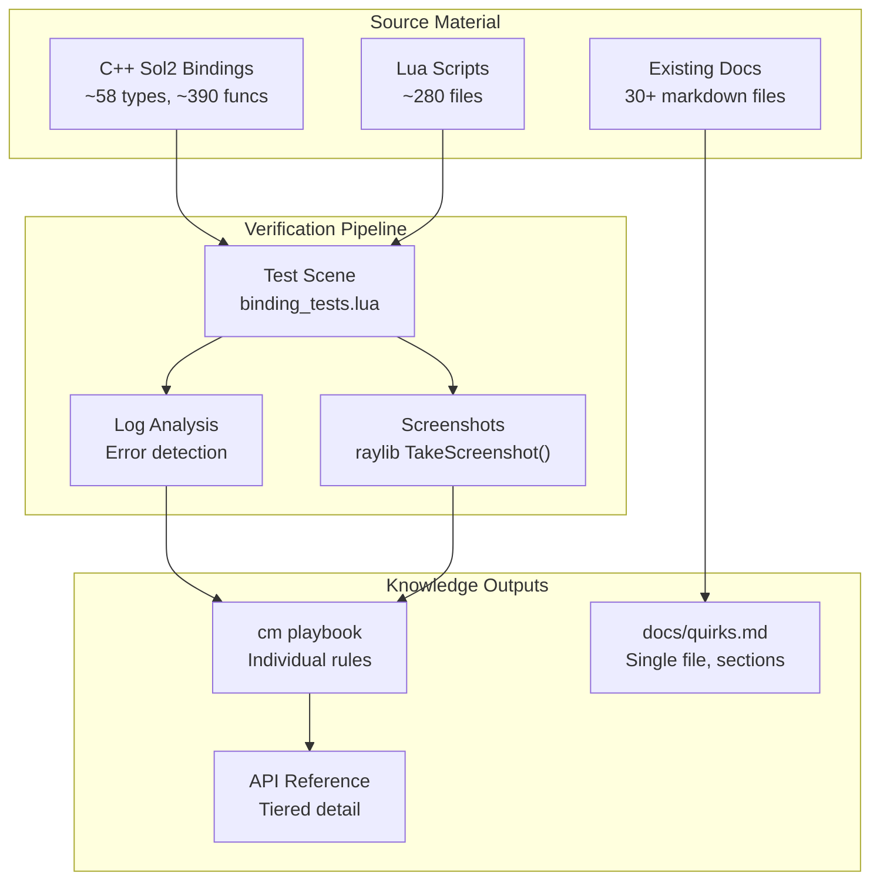

# Cass Memory Update Plan v0

**Project:** Comprehensive documentation extraction from TheGameJamTemplate
**Target:** `cm` playbook rules + `docs/quirks.md` + permanent test suite
**Status:** Planning Complete - Ready for Execution

---

## Executive Summary

Extract, verify, and document all Lua/C++ bindings, patterns, and quirks from TheGameJamTemplate into the `cm` (procedural memory) system. This creates a searchable knowledge base that reduces agent errors and accelerates development.

### Scope
| Category | Count | Status |
|----------|-------|--------|
| Sol2 Bindings | ~58 types, ~390 functions | To document |
| ECS Components | ~128 components | To document |
| Lua Scripts | ~280 files | To mine for patterns |
| Existing Docs | 30+ markdown files | To verify/update |

### Success Criteria
1. **Pain points resolved** - UI/UIBox and Entity lifecycle fully documented
2. **Coverage threshold** - 80%+ of commonly-used patterns documented with verification
3. **Test suite passing** - Permanent test scene exercises all documented patterns

---

## Architecture Overview



---

## Phase Breakdown

### Phase 1: Test Infrastructure Setup
**Effort:** M (Medium)
**Parallelizable:** No (Foundation for other phases)

Create the verification pipeline that all subsequent phases depend on.

**Deliverables:**
1. `assets/scripts/test/binding_tests.lua` - Main test harness
2. `assets/scripts/test/test_utils.lua` - Assertion helpers, screenshot capture
3. `assets/scripts/test/test_registry.lua` - Track which patterns have been tested
4. Screenshot output directory: `test_output/screenshots/`
5. Log capture mechanism for error detection

**Test Harness Design:**
```lua
-- binding_tests.lua structure
local TestRunner = {
    tests = {},
    results = {},
    screenshots = {}
}

function TestRunner:register(name, category, testFn)
    -- Register test with metadata
end

function TestRunner:run(filter)
    -- Run tests, capture logs, take screenshots
    -- TakeScreenshot("test_output/screenshots/" .. name .. ".png")
end

function TestRunner:report()
    -- Generate test report
end
```

**Acceptance Criteria:**
- [ ] Test harness loads without errors
- [ ] Can register and run individual tests
- [ ] Screenshots captured to `test_output/screenshots/`
- [ ] Log output captured and parsed for errors
- [ ] Test report generated with pass/fail status

---

### Phase 2: Sol2 Binding Inventory
**Effort:** L (Large)
**Parallelizable:** Yes (split by system)

Create complete inventory of all C++ bindings exposed to Lua.

**Sub-phases (can run in parallel):**

| Agent | System | Files | Est. Bindings |
|-------|--------|-------|---------------|
| A1 | Physics | physics_lua_bindings.cpp | ~103 |
| A2 | UI | ui.cpp, ui_pack_lua.cpp | ~79 |
| A3 | Timer/Animation | timer.cpp, anim_system.cpp | ~60 |
| A4 | Core Systems | scripting_bindings.cpp, globals.cpp | ~50 |
| A5 | Input/Sound/AI | input_lua_bindings.cpp, sound_system.cpp, ai_system.cpp | ~80 |
| A6 | Shaders/Layer | shader_system.cpp, layer_lua_bindings.cpp | ~40 |

**Deliverables per agent:**
1. Binding list: `planning/bindings/{system}_bindings.md`
2. Test file: `assets/scripts/test/test_{system}_bindings.lua`
3. cm rules for high-frequency bindings

**Binding Documentation Format:**
```markdown
## physics.segment_query
**Signature:** `physics.segment_query(world, start_point, end_point, callback)`
**Parameters:**
- `world` - Physics world reference
- `start_point` - {x, y} table
- `end_point` - {x, y} table
- `callback` - function(shape, point) called for each hit

**Example:**
\`\`\`lua
physics.segment_query(world, {x=0, y=0}, {x=100, y=0}, function(shape, point)
    local entity = physics.entity_from_ptr(shape)
    print("Hit entity:", entity)
end)
\`\`\`

**Verified:** Yes | Test: test_physics_bindings.lua:42
**Usage Frequency:** High (found in 23 files)
```

**Acceptance Criteria:**
- [ ] All 58 types documented with signatures
- [ ] All ~390 functions documented (tiered detail)
- [ ] High-frequency bindings have working examples
- [ ] Test files exercise each binding category
- [ ] cm rules added for commonly-used patterns

---

### Phase 3: ECS Component Documentation
**Effort:** L (Large)
**Parallelizable:** Yes (split by category)

Document all ~128 ECS components and their Lua accessibility.

**Sub-phases:**

| Agent | Category | Components |
|-------|----------|------------|
| B1 | Core + Graphics | TransformCustom, FrameData, SpriteComponent, etc. |
| B2 | Physics | ColliderComponent, PhysicsLayer, RaycastHit, etc. |
| B3 | UI | UIConfig, UIElementCore, UIStyleConfig, etc. |
| B4 | Combat | BuffInstance, Stats, DamageBundle, Ability, etc. |
| B5 | State + Input | StateTag, ActiveStates, NavSelectable, etc. |

**Deliverables:**
1. Component reference: `planning/components/{category}_components.md`
2. Lua accessibility matrix (which components can be accessed from Lua)
3. cm rules for component access patterns

**Component Documentation Format:**
```markdown
## TransformCustom
**Location:** `src/components/components.hpp`
**Lua Access:** Via `component_cache.get(entity, TransformCustom)`

**Fields:**
| Field | Type | Lua Writable | Description |
|-------|------|--------------|-------------|
| pos | vec2 | Yes | World position |
| rotation | float | Yes | Rotation in radians |
| scale | vec2 | Yes | Scale factor |

**Common Patterns:**
\`\`\`lua
local transform = component_cache.get(entity, TransformCustom)
transform.pos = {x = 100, y = 200}
\`\`\`

**Gotchas:**
- Setting pos directly updates physics body if ColliderComponent exists
- Scale affects children differently than parent
```

**Acceptance Criteria:**
- [ ] All 128 components listed
- [ ] Lua-accessible components clearly marked
- [ ] Field types and writability documented
- [ ] Common access patterns verified
- [ ] cm rules for component access gotchas

---

### Phase 4: Priority Pain Points (UI + Entity Lifecycle)
**Effort:** XL (Extra Large)
**Parallelizable:** Partially (UI and Entity can run in parallel)

Deep-dive documentation of the two most problematic areas.

#### 4A: UI/UIBox System
**Owner:** Agent C1

**Areas to document:**
1. UIBox creation and configuration
2. Alignment system (RenewAlignment requirements)
3. State tags (AddStateTagToUIBox patterns)
4. Panel visibility (Transform + UIBoxComponent.uiRoot)
5. Grid management (itemRegistry, grid, dsl.cleanupGrid)
6. ScreenSpaceCollisionMarker for click detection
7. DrawCommandSpace (World vs Screen)
8. ChildBuilder.setOffset patterns

**Source files to mine:**
- `assets/scripts/ui/` (58 files)
- `src/systems/ui/` (C++ side)
- `docs/guides/UI_PANEL_IMPLEMENTATION_GUIDE.md` (verify accuracy)

**Deliverables:**
1. `docs/quirks.md` - UI section
2. `assets/scripts/test/test_ui_patterns.lua`
3. 20+ cm rules for UI patterns and gotchas

#### 4B: Entity Lifecycle
**Owner:** Agent C2

**Areas to document:**
1. Script initialization order
2. attach_ecs timing (data assignment BEFORE attach)
3. GameObject component restrictions
4. script_field and safe_script_get patterns
5. Entity validation (ensure_entity, ensure_scripted_entity)
6. Component cache usage
7. Entity destruction and cleanup

**Source files to mine:**
- `assets/scripts/core/entity_builder.lua`
- `assets/scripts/core/entity_factory.lua`
- `docs/guides/entity-scripts.md` (verify accuracy)
- Working entity scripts in `assets/scripts/`

**Deliverables:**
1. `docs/quirks.md` - Entity Lifecycle section
2. `assets/scripts/test/test_entity_lifecycle.lua`
3. 15+ cm rules for entity patterns

**Acceptance Criteria:**
- [ ] All UI gotchas from CLAUDE.md verified and expanded
- [ ] All entity lifecycle gotchas documented
- [ ] Test scenes exercise each documented pattern
- [ ] Screenshots prove visual correctness
- [ ] cm rules capture critical ordering requirements

---

### Phase 5: Pattern Mining from Working Code
**Effort:** L (Large)
**Parallelizable:** Yes (split by directory)

Extract patterns from existing, working Lua code.

**Sub-phases:**

| Agent | Directory | Focus |
|-------|-----------|-------|
| D1 | core/ | Builder patterns, timer usage, signal handling |
| D2 | combat/ | Combat system integration, projectile patterns |
| D3 | ui/ | Working UI implementations (especially inventory) |
| D4 | data/ | Content definition patterns |
| D5 | wand/ | Card/wand system patterns |

**Extraction criteria:**
- Pattern appears in 3+ files = document as common pattern
- Pattern is complex but error-free = document as recommended approach
- Pattern differs from docs = flag for doc update

**Deliverables:**
1. Pattern catalog: `planning/patterns/{area}_patterns.md`
2. cm rules for each verified pattern
3. Updates to existing docs where code diverges

---

### Phase 6: Quirks.md Consolidation
**Effort:** M (Medium)
**Parallelizable:** No (consolidation task)

Consolidate all discovered quirks into single `docs/quirks.md`.

**Structure:**
```markdown
# Engine Quirks & Gotchas

## Table of Contents
1. [UI/UIBox System](#ui-uibox-system)
2. [Entity Lifecycle](#entity-lifecycle)
3. [Physics System](#physics-system)
4. [Lua/C++ Bindings](#lua-c-bindings)
5. [Rendering & Layers](#rendering--layers)
6. [Combat System](#combat-system)
7. [Input System](#input-system)

## UI/UIBox System
### UIBox Alignment
**Problem:** Children don't reposition after `ChildBuilder.setOffset`
**Solution:** Always call `ui.box.RenewAlignment(registry, container)` after offset changes
**Verified:** test_ui_patterns.lua:78
...
```

**Deliverables:**
1. `docs/quirks.md` (single file, all sections)
2. Reference from CLAUDE.md to quirks.md
3. cm rules cross-referenced to quirks.md sections

---

### Phase 7: Test Suite Finalization
**Effort:** M (Medium)
**Parallelizable:** No (integration task)

Finalize permanent test suite and verification.

**Tasks:**
1. Consolidate all test files into cohesive suite
2. Create test runner script
3. Document test coverage
4. Ensure all documented patterns have tests
5. Generate coverage report

**Deliverables:**
1. `assets/scripts/test/run_all_tests.lua`
2. `test_output/coverage_report.md`
3. CI-friendly test script (exit codes)

---

### Phase 8: cm Playbook Population
**Effort:** M (Medium)
**Parallelizable:** Yes (batch import possible)

Add all verified rules to cm playbook.

**Categories to use:**
| Category | Content |
|----------|---------|
| `ui-patterns` | UI construction patterns |
| `ui-gotchas` | UI pitfalls and requirements |
| `ecs-patterns` | Entity/component patterns |
| `ecs-gotchas` | Entity lifecycle pitfalls |
| `lua-bindings` | C++ binding usage |
| `physics-patterns` | Physics system patterns |
| `combat-patterns` | Combat system patterns |
| `rendering-patterns` | Draw/layer patterns |

**Rule format:**
```bash
cm playbook add "When using ChildBuilder.setOffset on UIBox containers, always call ui.box.RenewAlignment(registry, container) afterward to force child layout update" --category ui-gotchas
```

**Deliverables:**
1. All rules added to cm playbook
2. Rule export for backup: `planning/cm_rules_backup.json`
3. Verification that `cm context "<task>"` returns relevant rules

---

## Execution Order

```mermaid
gantt
    title Cass Memory Update Execution
    dateFormat  X
    axisFormat %s

    section Foundation
    Phase 1: Test Infra    :p1, 0, 1

    section Parallel Scan
    Phase 2: Sol2 Bindings :p2, after p1, 2
    Phase 3: Components    :p3, after p1, 2
    Phase 4A: UI Deep Dive :p4a, after p1, 2
    Phase 4B: Entity Lifecycle :p4b, after p1, 2

    section Mining
    Phase 5: Pattern Mining :p5, after p2, 1

    section Consolidation
    Phase 6: Quirks.md     :p6, after p4a p4b, 1
    Phase 7: Test Suite    :p7, after p5, 1
    Phase 8: cm Population :p8, after p6 p7, 1
```



---

## Agent Assignment Strategy

**Session 1 (This session):** Plan complete ✓

**Session 2:** Phase 1 (Test Infrastructure)
- Single agent builds test harness
- Verify screenshot capture works
- Verify log parsing works

**Session 3-4:** Phases 2-4 (Parallel Scan)
- Spawn 6 agents for Sol2 binding scan (A1-A6)
- Spawn 5 agents for component scan (B1-B5)
- Spawn 2 agents for pain points (C1-C2)

**Session 5:** Phase 5 (Pattern Mining)
- 5 agents mine different directories

**Session 6:** Phases 6-8 (Consolidation)
- Single agent consolidates and populates

---

## Risk Mitigation

| Risk | Mitigation |
|------|------------|
| Test harness fails | Fall back to manual verification with grep |
| Screenshot capture doesn't work | Use log analysis only |
| Some bindings undocumented in C++ | Document as "signature only, behavior TBD" |
| Parallel agents create conflicts | Use file reservations via MCP |
| cm playbook gets cluttered | Use strict categories, review before adding |

---

## Verification Checklist (Per Pattern)

- [ ] Pattern identified in working code
- [ ] Test code written exercising pattern
- [ ] Test runs without Lua errors
- [ ] Screenshot captured (if visual)
- [ ] Log shows no warnings/errors
- [ ] cm rule drafted
- [ ] Cross-referenced to existing docs (if any)

---

## Appendix: Codebase Statistics

### Sol2 Bindings by File
| File | Types | Functions |
|------|-------|-----------|
| physics_lua_bindings.cpp | 5 | 98 |
| ui.cpp | 22 | 57 |
| timer.cpp | 5 | 34 |
| ai_system.cpp | 1 | 35 |
| sound_system.cpp | 2 | 30 |
| scripting_bindings.cpp | 10 | 40 |
| input_lua_bindings.cpp | 3 | 25 |
| shader_system.cpp | 4 | 20 |
| layer_lua_bindings.cpp | 2 | 15 |
| anim_system.cpp | 3 | 20 |
| Others | ~5 | ~20 |
| **Total** | **~58** | **~390** |

### ECS Components by Category
| Category | Count |
|----------|-------|
| Core | 15 |
| Physics | 20 |
| Rendering | 8 |
| UI | 7 |
| Particles | 6 |
| Combat | 30+ |
| State | 9 |
| Input | 5 |
| Level Loading | 10 |
| Other | 18 |
| **Total** | **~128** |

### Lua Scripts by Directory
| Directory | Files |
|-----------|-------|
| core/ | 70 |
| tests/ | 112 |
| ui/ | 58 |
| combat/ | 23 |
| data/ | 21 |
| wand/ | 18 |
| ai/ | 12 |
| Other | ~30 |
| **Total** | **~280** |
