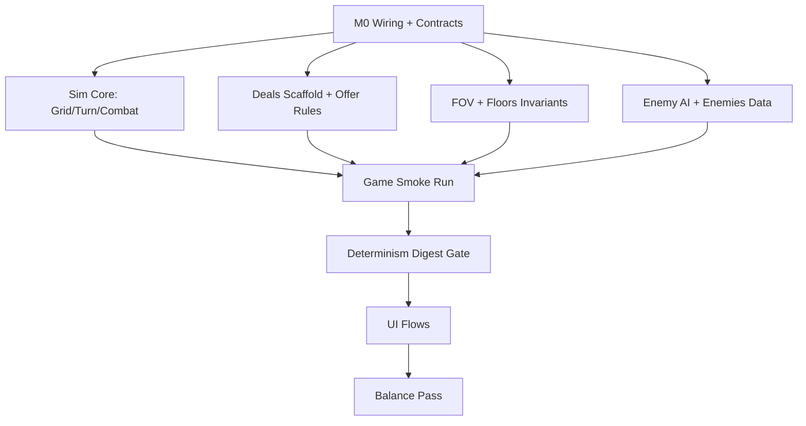

# Game #4 “Bargain” — Engineering Plan (Rewrite of `PLAN_codex_iter8.md`)

## 0) Goal, DoD, and explicit ship gates

### Goal (one complete, replayable vertical slice)
Deliver a deterministic, replayable 7-floor run loop:
- Floors 1–6: explore/combat → reach stairs
- Floor 7: boss (“Sin Lord”) → victory on defeat
- Death → game-over screen → restart → new seeded run
- Target run length: 10–15 minutes (balance is last)

### Definition of Done (all true)
**Stability**
- For seeds `S1,S2,S3`, a full run reaches **victory or death** with **0 crashes** and **0 softlocks**.

**Deal rules**
- At **every floor start**, before gameplay continues, present a **forced** deal:
  - `must_choose=true`, `can_skip=false`, sim cannot advance until chosen.
- At **every level-up**, present an **optional** deal:
  - `must_choose=false`, `can_skip=true`, player may skip and continue.

**Progression**
- Only progression mechanism is deals (no items, no meta-progression).
- Every accepted deal applies:
  - an immediate benefit, and
  - a permanent downside that changes gameplay (not text-only).

**Content**
- Exactly **21 deals** exist (7 sins × 3 deals) with stable IDs.
- **21/21 downsides enforced by automated tests** (≥1 assertion per deal that fails if downside is removed).

**Determinism**
- For fixed seed + scripted inputs, sim produces a stable **digest** across machines.

---

## 1) Constraints / non-goals (locked)

### Gameplay constraints
- Turn-based, grid-based, FOV-limited exploration/combat.
- Player verbs only: `Move` (4-way), `Attack` (directional), `Wait`.
- Enemy AI: chase + attack only; no A* (BFS/distance-field ok).

### Non-features
- No inventory/items/shops
- No save/load
- No meta-progression

### Engineering constraints
- Gameplay rules live in **pure Lua sim** (no engine globals, rendering, IO).
- UI is a thin adapter: render from `world`, translate input → sim actions.
- All randomness through **one injected RNG** owned by sim (`world.rng`).

---

## 2) Repository wiring (minimal hot-file edits)

### Run modes
- `AUTO_START_BARGAIN=1` → auto-enter Bargain loop (highest precedence)
- Manual entry remains: `require("bargain.game").start()`

### Test runner integration (binary-driven)
Reuse `assets/scripts/tests/test_runner.lua`.

Add `RUN_BARGAIN_TESTS=1` hook in `assets/scripts/core/main.lua`:
- runs early
- exits via `os.exit(0|1)`
- invokes `require("tests.run_bargain_tests").run()`

Invocation:
- `RUN_BARGAIN_TESTS=1 ./build-debug/raylib-cpp-cmake-template`

**Hot-file policy**
- Only the “integrator” bead edits `assets/scripts/core/main.lua`.
- Everyone else adds new modules/files under `assets/scripts/bargain/` and `assets/scripts/tests/`.

---

## 3) Folder layout + stable ownership lanes (parallel by default)

All new Bargain code under `assets/scripts/bargain/`:
- `sim/` — pure simulation (deterministic, no IO)
- `ui/` — rendering + input mapping + deal modal
- `data/` — deals/enemies/floors/balance tables (no behavior beyond `apply(...)`)
- `tests_support/` — fixtures/helpers used by tests only

Tests under `assets/scripts/tests/`:
- `test_bargain_*.lua`
- `run_bargain_tests.lua` (aggregator)

Ownership lanes (can run in parallel after contract freeze):
- **Integrator/Wiring:** `bargain/game.lua`, `bargain/ui/*`, `assets/scripts/core/main.lua`
- **Sim Core:** `bargain/sim/grid.lua`, `turn_system.lua`, `combat.lua`
- **Procgen/FOV:** `bargain/sim/fov.lua`, `bargain/sim/floors.lua`, `bargain/data/floors.lua`
- **AI/Enemies:** `bargain/sim/enemy_ai.lua`, `bargain/data/enemies.lua`
- **Deals/Content:** `bargain/sim/deals.lua`, `bargain/data/sins/*`
- **Determinism Harness:** `bargain/sim/digest.lua`, scripted-input helpers + determinism tests

---

## 4) “Contract freeze” (M0 deliverable; changes require tests-first)

### 4.1 World schema (must be stable)
Required fields (tests enforce presence and type-ish shape):
- `world.grid`
- `world.entities` (id → entity)
- `world.player_id`
- `world.turn` (int)
- `world.phase` (string enum)
- `world.floor_num` (1–7)
- `world.run_state` (`"playing"|"victory"|"death"`)
- `world.rng` (only RNG used by sim)
- `world.deals`:
  - `applied` (deal_id → true)
  - `history` (ordered list of `{deal_id, kind, floor_num, turn}`)
  - `pending_offer` (nil or offer struct)

Recommended-but-once-adopted-it’s-frozen:
- `world.stairs` (`{x,y}` or nil)
- `world.messages` (append-only deterministic structs; UI reads only)
- `world.debug_flags` (tests-only; must not affect release determinism)

### 4.2 Deal offer struct (stable)
`world.deals.pending_offer`:
- `kind` ∈ `{ "floor_start", "level_up" }`
- `offers` = array of deal IDs (stable order)
- `must_choose` = boolean
- `can_skip` = boolean

### 4.3 Entity schema (stable)
Required:
- `id`, `kind` (`"player"|"enemy"|"boss"`)
- `x`, `y`
- `hp`, `hp_max`, `atk`, `def`, `speed`, `fov_radius`
- `xp`, `level`
- `flags` (deterministic map)
- `hooks` (hook_name → array of callbacks; callback order stable)

### 4.4 Action encoding + invalid action behavior (stable)
- Move: `{type="move", dx=0|±1, dy=0|±1}`
- Attack: `{type="attack", dx=0|±1, dy=0|±1}`
- Wait: `{type="wait"}`

Invalid action policy (tests enforce):
- Return `{ok=false, err="..."}` and **consume actor’s turn** (deterministic).

### 4.5 Phase model (stable)
Phases:
- `DEAL_CHOICE` → `PLAYER_INPUT` → `PLAYER_ACTION` → `ENEMY_ACTIONS` → `END_TURN` → `PLAYER_INPUT`

Rules:
- If `pending_offer.must_choose=true`, sim stays in `DEAL_CHOICE` until a deal is chosen.
- Enemy order deterministic: sort by `speed`, tie-break by `id`.

---

## 5) Module APIs (each module ships with its test file)

Each module bead implements the module + its dedicated test(s). Tests define semantics; UI must not invent rules.

### `bargain/sim/grid.lua`
Exports:
- `Grid.new(w,h)`
- `get_tile/set_tile`, `is_opaque`
- `place_entity`, `move_entity`
- `get_occupant`, `can_move_to`
- `neighbors4(x,y)` (stable order)

Required tests:
- bounds/walls/entities block movement
- occupancy invariants (positions ↔ occupants consistent)
- neighbor ordering stable (tie-break expectations explicit)

### `bargain/sim/turn_system.lua`
Exports:
- `TurnSystem.new({world})`
- `queue_player_action(action)`
- `step()` advances exactly one phase transition
- `get_phase()`, `get_turn()`

Required tests:
- exact phase sequence (including deal gate)
- player acts before enemies
- enemy order deterministic (speed then id)

### `bargain/sim/combat.lua`
Exports:
- `resolve_attack(attacker_id, dx, dy, world) -> result`

Required tests (freeze damage semantics early):
- empty-target behavior
- deterministic damage formula (or RNG via `world.rng` only)
- death behavior (remove entity vs flag corpse; pick one and test it)

### `bargain/sim/fov.lua`
Exports:
- `update(world, cx, cy, radius)` writes visibility state
- `get_state(world, x, y)` ∈ `UNSEEN|SEEN|VISIBLE`

Required tests:
- small golden occlusion maps (hand-authored)
- memory transition: `VISIBLE → SEEN` when leaving LOS

### `bargain/sim/deals.lua` + `bargain/data/sins/*.lua`
Data contract:
- exactly 21 deals; stable `deal_id` strings
- each deal: `id`, `sin`, `name`, `benefit_text`, `downside_text`, `apply(world, player_id)`

System contract:
- `get_offers(kind, world) -> offer_struct` (stable ordering)
- `apply_deal(deal_id, world)`

Required tests:
- floor-start offer: exactly 1 offer; `must_choose=true`, `can_skip=false`
- level-up offer: exactly 2 offers; `must_choose=false`, `can_skip=true`
- already-applied deals cannot be offered again (unless explicitly allowed; default is “no”)
- **21/21 downside enforcement** via table-driven tests (ship gate)

### `bargain/sim/enemy_ai.lua` + `bargain/data/enemies.lua`
Exports:
- `decide(enemy_id, world) -> action`

Required tests:
- adjacent → attack
- otherwise move to reduce distance (Manhattan-first; BFS field when walls exist)
- deterministic tie-break (axis preference then id)

### `bargain/sim/floors.lua` + `bargain/data/floors.lua`
Exports:
- `generate(floor_num, seed, rng) -> {grid, entities, stairs?, metadata}`

Required tests (invariants-only; avoid brittle layout snapshots):
- floor sizes match table per floor
- enemy counts within allowed ranges
- stairs present on floors 1–6; none on floor 7
- floor 7 contains boss

### `bargain/game.lua` (integrator-owned)
Exports:
- `start()`, `update(dt)`
- `queue_action(action)`
- deal bridge:
  - `is_waiting_for_deal_choice()`
  - `choose_deal(deal_id)`
  - `skip_deal()` (only if allowed)

Test-safe debug hooks (never required for normal play; deterministic):
- `debug.goto_floor(n)`, `debug.set_hp(x)`, `debug.grant_xp(x)`

---

## 6) Test strategy (fast, deterministic, enforce-downsides-first)

### Required test modules (minimum)
- `test_bargain_grid.lua`
- `test_bargain_turn_system.lua`
- `test_bargain_combat.lua`
- `test_bargain_fov.lua`
- `test_bargain_enemy_ai.lua`
- `test_bargain_deals.lua` (offer rules + per-deal enforcement table)
- `test_bargain_data_loading.lua` (21 deals, stable IDs, no dupes)
- `test_bargain_floors.lua` (invariants only)
- `test_bargain_game_smoke.lua` (multi-floor minimal run)
- `test_bargain_determinism.lua` (digest gate)

### Fixture rules
- Unit tests use tiny hand-authored maps (no procgen).
- Procgen tests are invariants-only, with a bounded set of seeds.
- Tests must not depend on rendering or frame timing.

### Downside enforcement pattern (table-driven; mandatory)
For each deal, the test provides:
- a minimal setup `world` + `player` state
- apply the deal
- execute 1–3 sim steps or actions
- assert an observable, gameplay-affecting downside outcome

Examples of “observable downside outcomes” (must be assertable quickly):
- stat clamp/penalty changes combat or movement outcome
- per-turn tax (hp drain) triggers after `END_TURN`
- action restriction (e.g., cannot `wait`) yields `{ok=false,...}` and consumes turn
- self-damage on move/attack changes hp after action
- XP gain reduction changes level-up timing in a short scripted sequence

---

## 7) Milestones (each has deliverables + command-level acceptance)

### M0 — Wiring + contract freeze (unblocks all parallel work)
Deliverables:
- `RUN_BARGAIN_TESTS=1` hook + `assets/scripts/tests/run_bargain_tests.lua`
- stub modules with correct exports
- contract tests for: `world` shape, action encoding, phase machine, offer gating

Acceptance:
- `RUN_BARGAIN_TESTS=1 <binary>` runs and exits `0` on pass, `1` on fail
- all tests deterministic across two consecutive runs

### M1 — Core sim loop (tiny fixed map)
Deliverables:
- movement/collision (`grid`)
- phase loop (`turn_system`, including deal gate)
- combat resolution (`combat`)

Acceptance:
- `grid/turn/combat` tests pass
- smoke: fixed 5×5 map, player can kill one enemy and advance turns without desync

### M2 — FOV + floors invariants
Deliverables:
- FOV occlusion + memory (`fov`)
- floor generator meets invariants for floors 1–7 (layout can be simple early)

Acceptance:
- `fov/floors` tests pass
- generation bounded (no unbounded loops) and deterministic for a fixed seed

### M3 — Deals (21) + enforced downsides (content ship gate)
Deliverables:
- offer rules (forced floor-start; optional level-up)
- all 21 deals implemented with real benefits + test-visible downsides
- downside enforcement tests (21 rows, 21 assertions minimum)

Acceptance:
- data loading proves 21 stable IDs, no duplicates, no missing sins
- deal tests prove offer rules + 21/21 downside enforcement

### M4 — Enemies + boss + win/lose
Deliverables:
- enemy templates + deterministic chase/attack AI
- boss on floor 7
- victory/death state transitions

Acceptance:
- enemy AI tests pass
- `run_state="victory"` when boss defeated
- `run_state="death"` when player hp ≤ 0 (and game can restart)

### M5 — UI flows (manual checklist + smoke automation where possible)
Deliverables:
- deal modal (forced vs optional skip)
- HUD (HP/stats/deals/floor/turn)
- victory/death screens + restart flow

Acceptance (manual checklist, recorded in a short markdown note):
- forced deal cannot be skipped
- level-up deal can be skipped
- restart produces a new seeded run

### M6 — Determinism hardening (digest gate)
Deliverables:
- stable orchestrator in `bargain/game.lua` (no hidden time/randomness)
- smoke tests for `S1,S2,S3` that run a full run to death/victory (scripted inputs)
- determinism digest test for the same seeds

Acceptance:
- smoke passes for `S1,S2,S3`
- digest matches expected strings for `S1,S2,S3` across two machines

### M7 — Balance pass (time-to-complete target)
Deliverables:
- `data/balance.lua` tuning surface (single place to edit)
- 3 timed seeded runs recorded as notes (inputs + outcome + duration)

Acceptance:
- average completion time ~10–15 minutes
- at least one seed winnable without debug hooks

---

## 8) Determinism digest (precise spec; test-owned)

### Digest contents (stable ordering; no table iteration)
Serialize:
- `floor_num`, `turn`, `phase`, `run_state`
- player: `(x,y,hp,hp_max,xp,level,atk,def,speed,fov_radius)`
- entities: list of `(id,kind,x,y,hp,flags_subset)` sorted by `id`
- applied deal IDs sorted lexicographically

### Determinism rules (review + tests enforce)
- Never rely on Lua table iteration order for digest or offers.
- Offer selection uses explicit ordering.
- AI/path tie-breakers are explicit.
- Only `world.rng` provides randomness (`math.random`, time, OS calls forbidden).

### Scripted input for determinism test
- Define action list (50–200 actions) that:
  - chooses deals when prompted
  - moves/attacks/waits deterministically
- Test runs: `seed + actions → digest`
- Gate: digest equals expected for each seed.

---

## 9) Parallel work breakdown (Beads-ready, small and test-first)

### Critical path (must happen early)
1) M0 wiring + contract tests (integrator)
2) Core sim loop tests (grid/turn/combat)
3) Deals scaffolding + offer gating (so UI/smoke can progress)
4) Determinism digest utilities (so new features don’t drift)

### Bead templates (recommended)
- **Module bead:** implement one module + its test file(s).
- **Sin bead:** implement `bargain/data/sins/<sin>.lua` (3 deals) + add 3 enforcement rows to `test_bargain_deals.lua`.
- **Floors bead:** add/adjust invariants + generator changes + invariants tests.
- **UI bead:** deal modal + input mapping + a smoke checklist note.

### Suggested dependency graph (Mermaid)

---

## 10) Coordination rules (repo workflow integration)
- Use BV to identify ready beads, then claim a bead (`in_progress`) before starting.
- Keep beads small: “one module / one sin / one UI feature”.
- Contract changes require: tests update first → module updates → integrator updates → notify dependents.
- Keep file ownership clear (especially `assets/scripts/core/main.lua` and `bargain/game.lua`).