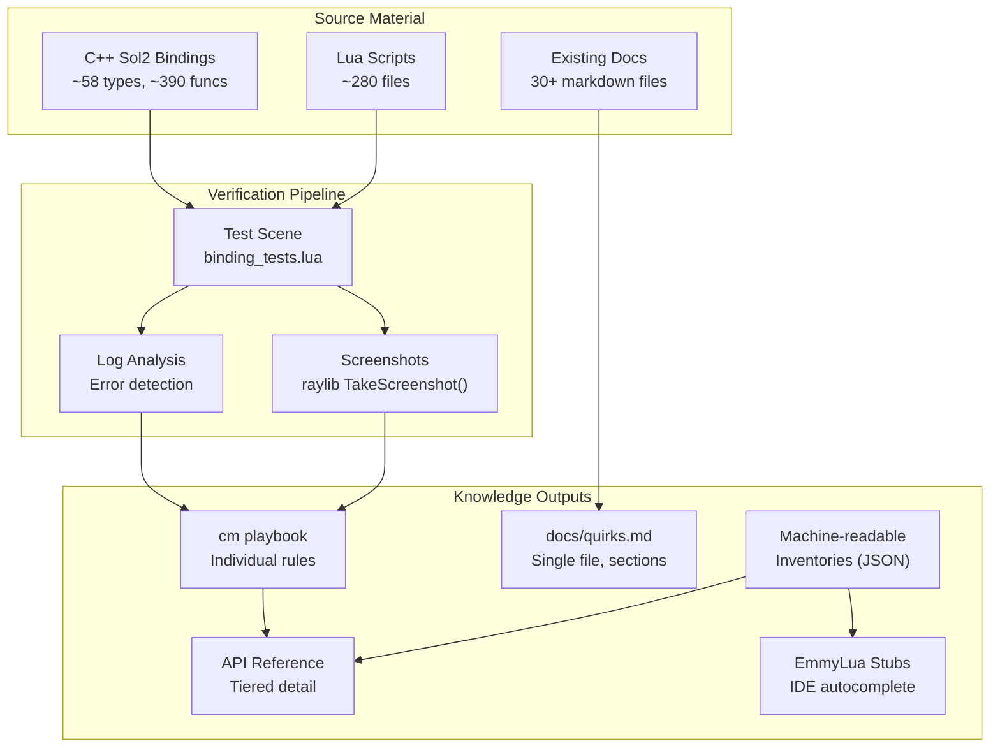

# Cass Memory Update Plan v1 (Implementation-Ready Revision)

**Project:** Comprehensive documentation extraction from TheGameJamTemplate
**Target:** `cm` playbook rules + `docs/quirks.md` + permanent test suite
**Status:** Planning Complete - Ready for Execution (Phase 1 pre-flight checklist required before scaling test authoring)

**Revision History:**
- v0: Initial implementation-ready plan with detailed specifications
- v1: Integrated GPT Pro revisions for drift prevention, automation, and CI-friendliness

> **Implementation assumption (make implicit dependencies explicit):**
> - This plan assumes (a) the repo can run Lua deterministically in a "test scene" context, and (b) the `cm` CLI (or equivalent) is available wherever Phase 8 runs. If either is false, Phase 1 must record the alternative (e.g., different runner, different memory system) and Phase 8 must adapt the exact import/export commands accordingly.

> **Plan ownership (clarity):**
> - Assign a single plan owner for Phase 1, Phase 6–8 consolidation, and final sign-off on schema decisions (report formats, registry schema). Record owner name/handle in the Phase 1 README update to eliminate ambiguity for parallel agents.

> **Non-goals (scope control):**
> - This plan does **not** attempt to refactor engine systems, redesign UI architecture, or change gameplay behavior beyond adding test-only hooks/helpers needed for deterministic verification.
> - Where a fix is discovered during documentation/testing, record it as a follow-up task with `source_ref` and `doc_id`; do not silently expand scope without explicit approval.

---

## Executive Summary

Extract, verify, and document all Lua/C++ bindings, patterns, and quirks from TheGameJamTemplate into the `cm` (procedural memory) system. This creates a searchable knowledge base that reduces agent errors and accelerates development.

**New developer-facing output (high leverage):**
- Generate IDE stubs (EmmyLua) for Lua-facing API from the binding inventory so humans get autocomplete and signatures.

### Scope
| Category | Count | Status |
|----------|-------|--------|
| Sol2 Bindings | ~58 types, ~390 functions | To document |
| ECS Components | ~128 components | To document |
| Lua Scripts | ~280 files | To mine for patterns |
| Existing Docs | 30+ markdown files | To verify/update |

> **Scope validation requirement (for completeness + truthfulness):** The counts above are *estimates* and must be validated during Phase 2/3 inventory passes. If a final count differs, update the tables and acceptance criteria with exact totals.

> **Scope reconciliation requirement (prevent drift across sections):**
> - When final totals are validated, update them in all three places: **Scope table**, **Phase 2/3 Acceptance Criteria**, and **Appendix tables**, in the same edit batch so the plan stays internally consistent.

### Success Criteria
1. **Pain points resolved** - UI/UIBox and Entity lifecycle fully documented
2. **Coverage threshold** - 80%+ of commonly-used patterns documented with verification
3. **Test suite passing** - Permanent test scene exercises all documented patterns

> **Coverage definition (for testability):** "80%+ of commonly-used patterns" means: among patterns flagged **High-frequency** (per the frequency definition below), ≥ 80% have a corresponding passing test id in the harness report.

> **"Test suite passing" definition (deterministic):**
> - "Passing" means `test_output/status.json` has `passed: true` **and** `test_output/report.md` contains no `FAIL` entries (per the stable report schema defined below).

### Definitions (for consistency + testability)
- **"Binding"**: Any Lua-exposed type/function/constant created via Sol2, including methods on usertypes and free functions.
- **"Component documented"**: Listed with source location, fields, Lua access method, and at least one verified access example.
- **"Verified"**: A corresponding Lua test runs through the engine without Lua errors; for visual features, also produces at least one expected screenshot; for non-visual, produces log/assert evidence.
- **"High-frequency"**: Appears in ≥ 3 Lua files **or** ≥ N occurrences, where N is recorded in the binding/component doc.

> **Evidence specificity (to make "Verified" deterministic across agents):**
> - **Non-visual Verified** requires: test appears in `test_output/report.md` as `PASS`, and either (a) harness emits `TEST_PASS: <test_id>` or (b) report includes `passed=true` for that test id.
> - **Visual Verified** requires: non-visual requirements **plus** a screenshot file exists at `test_output/screenshots/<safe_test_id>.png` and is referenced in the report (image comparison is optional unless later added).

> **Stronger Visual Verified (recommended):**
> - If a baseline exists at `test_baselines/screenshots/<safe_test_id>.png` (or per-platform subfolder),
>   the harness must compare and mark the test failed on mismatch (with tolerance).
> - If no baseline exists, mark the test `PASS (no baseline)` but flag it in the report as **NeedsBaseline**.

> **Baseline management (new):**
> - Add a harness flag `--record-baselines` (manual only) to write/update baseline images.
> - CI must never run in record mode.

> **Frequency measurement requirement (repeatable):** Record the exact search method used (tool/command/pattern) per system, so another agent can reproduce the counts.

> **Frequency automation (new, recommended):**
> - Provide `scripts/frequency_scan.(py|lua)` that accepts:
>   - an input list of Lua-facing names/patterns,
>   - a set of search roots (default: `assets/scripts/`),
>   - optional comment-ignore mode,
> - and outputs `planning/inventory/frequency.{system}.json`.
> - Agents must reference the JSON output in docs rather than hand-copied counts.

> **Frequency threshold specificity (clarity):**
> - Default `N = 10` occurrences unless a system owner records a different N with rationale (e.g., noisy identifiers).
> - Always record both: `files_with_match` and `total_occurrences` even if the High-frequency decision uses only one.
> - Record exact commands used (examples below are templates; update with the repo's real paths once Phase 1 confirms conventions):
>   - `rg -n --glob 'assets/scripts/**/*.lua' 'physics\\.segment_query'`
>   - If comment filtering is needed: record the rule used (e.g., "ignore lines starting with `--`") and the command/script used to apply it.
> - **Decision rule clarity:** If either condition triggers (≥3 files OR ≥N occurrences), mark High-frequency as `Yes` and record which condition(s) triggered (e.g., `High-frequency: Yes (files>=3, occurrences>=N)`).

> **Test ID and naming vocabulary (clarity across phases):**
> - Use stable "system" prefixes consistently across docs/tests/registry: `physics`, `ui`, `ecs`, `core`, `input`, `sound`, `ai`, `shader`, `layer`, `combat`, `rendering`, `timer`, `anim`.
> - If the repo has established naming that conflicts, Phase 1 must document the canonical mapping and the plan should be updated to match (do not mix naming vocabularies).

---

## Architecture Overview



> **Screenshot API clarity (implementability):** If the engine does not expose raylib directly, treat "raylib TakeScreenshot()" as "engine `TakeScreenshot()` (or equivalent)" and record the exact Lua-callable function name + constraints during Phase 1 pre-flight.

> **API reference location (completeness):**
> - The "API Reference" output must have a concrete on-disk destination to avoid becoming a vague deliverable. Default recommendation: `planning/api_reference.md` (or a `docs/reference/` file if a convention exists). Phase 1 must confirm the preferred location and record it in the test README update.

> **API reference deliverable clarification (completeness + implementability):**
> - Unless Phase 1 chooses a different destination, treat the **collection** of:
>   - `planning/bindings/*.md` (Phase 2),
>   - `planning/components/*.md` + `planning/components/lua_accessibility_matrix.md` (Phase 3),
>   - and `planning/patterns/*.md` (Phase 5),
> as the "API Reference" output. Optionally add `planning/api_reference.md` as a stable index linking to those files.

**Traceability requirement (applies to all phases):**
- Every documented item that claims **Verified: Yes** must reference:
  - the exact test file name, and
  - the test name (string) registered in the harness, and
  - a durable identifier (e.g., `Test: test_physics_bindings.lua::physics.segment_query.hit_entity`).
- Every `docs/quirks.md` entry must reference at least one:
  - verified test id, or
  - source file + function name (if not yet testable), labeled explicitly as "Unverified".

> **Uniform test id format (clarity + durability):** All tests must use the canonical id format:
> `Test: <test_file>::<test_id>` where `<test_id>` follows `{system}.{feature}.{case}`.

> **Test file reference convention (remove ambiguity):**
> - In `Test: ...` references, `<test_file>` is the **basename** of a file that lives under `assets/scripts/test/` (e.g., `test_physics_bindings.lua`).
> - Docs may optionally also include the full path for human convenience (e.g., `assets/scripts/test/test_physics_bindings.lua`), but the canonical durable identifier remains the basename-based `Test:` form.

> **Doc/test ID scheme (completeness + CI-friendly mapping):**
> - Define stable `doc_id` strings for coverage mapping:
>   - Bindings: `binding:<lua_facing_name>` (e.g., `binding:physics.segment_query`)
>   - Components: `component:<ComponentName>` (e.g., `component:TransformCustom`)
>   - Patterns: `pattern:<system>.<feature>.<case>` (e.g., `pattern:ui.uibox_alignment.renew_after_offset`)
> - The test registry must map `doc_id -> test_id` (or `Unverified` reason) so coverage reports are generated deterministically.
> - **Doc authoring requirement (completeness):** Every binding/component/pattern doc section must include its `doc_id` explicitly so Phase 7 can update `test_registry.lua` deterministically without guesswork.

> **Source reference format (clarity + repeatability):**
> - Use a consistent `source_ref` string in docs/registry so another agent can jump to the implementation quickly:
>   - Preferred: `<path>:<symbol_or_anchor>` (e.g., `src/systems/ui/ui.cpp:UIBox` or `assets/scripts/core/entity_builder.lua:attach_ecs`).
>   - If symbol is unknown, use `<path>#L<line>` as a temporary fallback and replace once symbol/anchor is known.

---

## Phase Breakdown

### Phase 1: Test Infrastructure Setup
**Effort:** M (Medium)
**Parallelizable:** No (Foundation for other phases)

Create the verification pipeline that all subsequent phases depend on.

**Deliverables:**
1. `assets/scripts/test/binding_tests.lua` - Main test harness
2. `assets/scripts/test/test_utils.lua` - Assertion helpers, screenshot capture
3. `assets/scripts/test/test_registry.lua` - Track which patterns have been tested
4. Screenshot output directory: `test_output/screenshots/`
4b. **(New)** Per-test artifacts directory: `test_output/artifacts/<safe_test_id>/`
5. Log capture mechanism for error detection
6. Test run documentation update: `assets/scripts/test/README.md` (or closest existing test README referenced by Phase 1 "How-to-run capture")

> **Test file layout convention (clarity + implementability):**
> - `assets/scripts/test/binding_tests.lua` provides the `TestRunner` implementation and shared runner logic.
> - `assets/scripts/test/test_*.lua` files are *modules* that only register tests (no direct execution side effects besides registration).
> - `assets/scripts/test/run_all_tests.lua` (Phase 7 deliverable) is the canonical execution entrypoint that requires `binding_tests.lua`, requires all `test_*.lua` modules, calls `TestRunner:run(...)`, and writes reports.

> **Naming convention requirement (avoid later churn):**
> - System test modules must follow a predictable naming pattern so `run_all_tests.lua` (and any module list) stays stable:
>   - Phase 2 bindings: `assets/scripts/test/test_<system>_bindings.lua` (e.g., `assets/scripts/test/test_physics_bindings.lua`)
>   - Phase 4 UI patterns: `assets/scripts/test/test_ui_patterns.lua`
>   - Phase 4 entity lifecycle: `assets/scripts/test/test_entity_lifecycle.lua`
> - If a different convention already exists in-repo, Phase 1 must document it and the plan should be updated to match (do not mix conventions).

> **Repo hygiene requirement (test_output):**
> - If `test_output/` is not intended to be committed, add a `.gitignore` entry and commit an empty marker directory only if the runtime requires it.
> - If the runtime cannot create directories, commit `test_output/screenshots/.gitkeep` (or equivalent) so screenshots can be written deterministically.
> - **Git cleanliness specificity (implementability):** Prefer committing `.gitignore` rules that ignore `test_output/**` while allowing the marker directory file (e.g., keep `.gitkeep`) if required by runtime.

> **.gitignore specificity (reduce interpretation):**
> - If needed, the recommended pattern is:
>   - ignore `test_output/**`
>   - allow `test_output/screenshots/.gitkeep` (or equivalent marker) so the directory exists deterministically.

**Pre-flight environment verification (must complete before writing lots of tests):**
- Identify how the project loads Lua entrypoints for a "test scene":
  - Where is the scene selected/bootstrapped?
  - How to run a script deterministically (no gameplay randomness) for repeatable screenshots?
- Confirm `TakeScreenshot()` is available in the Lua environment and when it is safe to call:
  - If it requires end-of-frame, provide a helper `test_utils.screenshot_after_frames(name, nFrames)`.
- Confirm write access for outputs:
  - If the Lua environment cannot create directories/files, require the directory to exist in repo (`test_output/screenshots/` committed as empty dir marker) and write-only operations within it.

> **Pre-flight discovery requirement (make Phase 1 actionable):**
> - During Phase 1, record *exactly* where the "entrypoint" is chosen (file path + function/identifier) and how to switch to a test entrypoint.
> - Record the exact run procedure in the README (Phase 1 deliverable), including any CLI flags or scene names (even if it's "open the project and select scene X").

> **Go/No-Go gates (new, required outputs of Phase 1):**
> - Deterministic test scene runnable: Yes/No (with exact procedure)
> - `test_output/` writable: Yes/No (with constraints)
> - Screenshot capture callable: Yes/No (with safe call timing)
> - Log capture workable: Yes/No (engine hook or fallback)
> - World reset between tests: Yes/No (preferred) / Strategy documented
> - If any is **No**, Phase 1 must update downstream phases to avoid false promises (e.g., mark all visual verification as "no baselines, screenshot-only").

> **Determinism checklist (specific + testable):** During pre-flight, record and enforce:
> - RNG seeding: `math.randomseed(<fixed>)` (and any engine RNG seed if applicable)
> - Fixed timestep / frame count driving for screenshot tests
> - Disabling or accounting for frame-time-dependent animations (or waiting N frames deterministically)
> - Explicit camera setup for rendering tests (if applicable)

> **How-to-run capture (completeness):** In Phase 1, document the exact run procedure (CLI args / scene selection / script entrypoint) as a short section appended to `assets/scripts/test/README.md` (or the closest existing test README) so other agents can run tests without reverse-engineering.

> **UBS specificity requirement (clarity, moved from Phase 8):**
> - **Phase 1 preflight (required):** identify what "UBS" is in this repo and the concrete invocation(s) (command/script). Record in the test README and treat as a release gate for Phase 8 changes.

> **Phase 1 implementation checklist (specificity):**
> - Confirm the authoritative test entry file(s) (e.g., whether the engine loads `assets/scripts/test/run_all_tests.lua`, loads `assets/scripts/test/binding_tests.lua` directly, or loads a scene script that `require`s the runner).
> - Decide a single canonical "run all tests" path early:
>   - interactive dev: run a scene that executes the runner
>   - CI/headless (if possible): run a single command/script that produces `test_output/status.json` and `test_output/report.md`
> - Decide how tests advance frames deterministically (if engine is frame-driven):
>   - Provide `test_utils.step_frames(n)` or equivalent.
> - Decide how failures are surfaced:
>   - report + `TEST_FAIL:` marker lines, plus a final pass/fail marker.

> **Phase 1 concrete task list (specificity + completeness):**
> - Create/confirm the directory `assets/scripts/test/` and decide module require paths (Lua package path expectations).
> - Implement `test_utils.safe_filename(test_id)` and use it everywhere screenshots are written and referenced.
> - Implement `test_utils` assertions with a consistent failure model (fail current test; optionally fail-fast).
> - Implement deterministic output writing for `test_output/status.json` and `test_output/report.md` every run (even if zero tests).
> - Decide and document whether output is wiped per run (recommended: wipe `test_output/` contents on start, except `.gitkeep`).
> - Decide and document a minimal "hello world" test module to validate plumbing (e.g., `test_smoke.lua` registering 1–2 tests) without blocking Phase 2 authors.

**Test Harness Design:**
```lua
-- binding_tests.lua structure
local TestRunner = {
    tests = {},
    results = {},
    screenshots = {}
}

function TestRunner:register(name, category, testFn)
    -- Register test with metadata
end

function TestRunner:before_each(test)
    -- Called before each test for isolation
end

function TestRunner:after_each(test)
    -- Called after each test for cleanup
end

function TestRunner:run(filter)
    -- Run tests, capture logs, take screenshots
    -- TakeScreenshot("test_output/screenshots/" .. name .. ".png")
end

function TestRunner:report()
    -- Generate test report
end
```

> **Register API naming clarity (implementability):**
> - Treat `name` in the stub above as the canonical `test_id` (string) following `{system}.{feature}.{case}`.
> - If the repo prefers a human-friendly display name, add it as `opts.display_name` rather than changing the canonical `test_id`.

> **Harness API specifics (so it is actually implementable):**
> - `register(name, category, testFn, opts)` where `opts` may include `tags`, `source_ref`, and `timeout_frames` (if frame-driven).
> - `run(filter)` where `filter` supports:
>   - `category` exact match OR list
>   - `name_substr` match
>   - `tags_any` / `tags_all` (optional but recommended)
> - `report()` writes a deterministic report file and returns a Lua boolean `passed`.

**Required behavior details (for specificity + CI-friendliness):**
- **Registration metadata**: `name`, `category`, `tags` (optional), and `source_ref` (optional, e.g. C++ file or doc section).
- **Filtering**: allow running by `category` and/or `name` substring, so Phase 2/3 agents can iterate quickly.
- **Assertions**: `test_utils.assert_*` functions that:
  - mark the current test failed,
  - continue or stop based on a `--fail-fast` flag (or boolean `failFast`).
- **Log capture**: provide a Lua-level "test logger" that records:
  - info/warn/error counts,
  - last N log lines,
  - and test-local logs.
  - If engine logs cannot be intercepted, standardize all tests to report to `test_output/test_log.txt` using a single helper (or leave as console-only but still parseable by harness).
- **Report output**: generate `test_output/report.md` (or similar) with:
  - pass/fail summary,
  - failing tests list,
  - and a list of screenshots generated.

> **Isolation requirement (new, critical for reliability):**
> - Tests must be order-independent by default.
> - The harness must support `before_each` / `after_each` hooks and call them around every test.
> - Provide a `test_utils.reset_world()` (or `reset_scene()`) contract:
>   - clears spawned test entities,
>   - resets global registries used by UI/physics where feasible,
>   - resets RNG seed(s),
>   - and returns to a known camera/UI root state.
> - If full reset is impossible, require `tags = {"serial"}` and run those tests in a dedicated engine session or in a fixed order.

> **Report/status schema requirement (testability + CI-friendliness):**
> - `test_output/status.json` must be machine-readable and stable. Minimum schema:
>   - `{"passed": true/false, "failed": <int>, "passed_count": <int>, "total": <int>, "generated_at": "<iso8601>" }`
> - **(New, recommended)** Extend schema for traceability:
>   - `commit` (git SHA if available), `branch`, `platform`, `engine_version`, `duration_ms`
> - **(New, required)** Write `test_output/results.json` with per-test objects:
>   - `{"test_id": "...", "test_file": "...", "category": "...", "status":"pass|fail|skip", "duration_ms":123, "artifacts":[...], "error":{...}}`
> - `test_output/report.md` must include:
>   - a stable summary section (totals + pass/fail),
>   - a deterministic ordered list of test results,
>   - and a screenshot list with exact file paths and (if present) links to per-test artifact folders:
>     - `test_output/artifacts/<safe_test_id>/`
> - **Deterministic ordering requirement:** Sort tests by `category`, then `test_id` (or strictly by `test_id`) so diffs are stable across runs.

> **Report.md stable section markers (specificity + implementability):**
> - The report must include these literal headings (case-sensitive) so downstream tooling can grep reliably:
>   - `## Summary`
>   - `## Results`
>   - `## Failures`
>   - `## Screenshots`
> - Each test result line must be parseable and deterministic, e.g.:
>   - `- PASS test_ui_patterns.lua::ui.uibox_alignment.renew_after_offset`
>   - `- FAIL test_entity_lifecycle.lua::ecs.attach_ecs.assign_before_attach - <reason>`

> **Error handling requirement (testability):**
> - Wrap each test function in `pcall` (or equivalent) so one crash produces a single test failure with stack trace captured in the report.
> - Normalize failures to include: `test_id`, `error_message`, and `stack_trace` (if available).

> **Filename safety requirement (clarity):**
> - Convert test ids to safe screenshot filenames (replace `/` and spaces; keep stable mapping).
> - **Safe filename specificity (implementability):** Define a single `test_utils.safe_filename(test_id)` rule (e.g., lowercase; replace all non `[a-z0-9._-]` with `_`) so both harness and docs can compute the same expected path.

> **Registry schema requirement (testability):**
> - `assets/scripts/test/test_registry.lua` must be the single source of truth for coverage mapping.
> - Minimum schema (example; exact shape may vary but must be deterministic and machine-readable):
>   - `return { docs = { [doc_id] = { test_id = "...", status = "verified"|"unverified", reason = "...", source_ref = "..." } } }`
> - The coverage report generator must be data-driven from this file (no manual lists).
> - **Deterministic output requirement:** ensure registry iteration order is deterministic in report generation (e.g., sort keys) so diffs are stable.
> - **Recommended (optional) fields for completeness:** `test_file`, `category`, `tags`, `quirks_anchor` (if applicable), to support richer reporting without requiring doc scraping.

**Acceptance Criteria:**
- [ ] Test harness loads without errors
- [ ] Can register and run individual tests
- [ ] Screenshots captured to `test_output/screenshots/`
- [ ] Log output captured and parsed for errors
- [ ] Test report generated with pass/fail status
- [ ] `test_output/status.json` is generated and matches the minimum schema
- [ ] `test_output/report.md` includes stable section markers and deterministic ordering
- [ ] **(New)** `test_output/results.json` is generated with per-test objects
- [ ] **(New)** Go/No-Go gates documented with exact procedures/strategies
- [ ] **(New)** `before_each` / `after_each` hooks implemented; `test_utils.reset_world()` strategy documented

---

### Phase 2: Sol2 Binding Inventory
**Effort:** L (Large)
**Parallelizable:** Yes (split by system)

Create complete inventory of all C++ bindings exposed to Lua.

**Sub-phases (can run in parallel):**

| Agent | System | Files | Est. Bindings |
|-------|--------|-------|---------------|
| A1 | Physics | physics_lua_bindings.cpp | ~103 |
| A2 | UI | ui.cpp, ui_pack_lua.cpp | ~79 |
| A3 | Timer/Animation | timer.cpp, anim_system.cpp | ~60 |
| A4 | Core Systems | scripting_bindings.cpp, globals.cpp | ~50 |
| A5 | Input/Sound/AI | input_lua_bindings.cpp, sound_system.cpp, ai_system.cpp | ~80 |
| A6 | Shaders/Layer | shader_system.cpp, layer_lua_bindings.cpp | ~40 |

**Per-agent working protocol (to avoid conflicts and ensure parallelizability):**
- Each agent edits only their deliverable files:
  - `planning/bindings/{system}_bindings.md`
  - `assets/scripts/test/test_{system}_bindings.lua`
- Use file reservations via MCP for those paths before writing.
- Cross-system shared items (e.g., core utility bindings) must be proposed in a short note, then assigned to one owner to avoid duplication.

> **Coordination requirement (clarity):** Each agent posts a short "System inventory started" and "System inventory complete" note (with file paths) in the shared Agent Mail thread for Phase 2, so consolidation can track progress.

> **Phase 2 folder readiness (implementability):**
> - Ensure `planning/bindings/` exists before parallel agents start work (create in Phase 2 kickoff if missing).
> - Ensure `planning/inventory/` exists for machine-readable outputs.
> - If the repo prefers a different planning folder structure, Phase 2 kickoff must record the canonical paths and update this plan accordingly (do not let agents create divergent directory layouts).

**Deliverables per agent:**
1. Binding list: `planning/bindings/{system}_bindings.md`
2. Test file: `assets/scripts/test/test_{system}_bindings.lua`
3. cm rules for high-frequency bindings
4. **(New)** Machine-readable binding inventory: `planning/inventory/bindings.{system}.json`

> **cm parallelization requirement (to avoid shared-state conflicts):**
> - During Phase 2, agents **draft** cm rules as candidates in their system docs (or in a clearly marked "cm candidates" subsection) and ensure every candidate rule has a `doc_id` + `Test:` reference (or `Unverified:`).
> - Phase 8 performs the actual `cm playbook add` population (single-owner consolidation) to keep `cm` state changes serialized and reviewable.

**Binding extraction requirements (specific + repeatable):**
- For each source C++ file listed, enumerate:
  - usertypes (types), methods, properties, constants, and free functions.
- Record the exact Lua-facing name (including namespaces/tables), not C++ symbol name.
- For each binding, record:
  - signature as used from Lua (best-effort),
  - parameter semantics,
  - return shape,
  - and any side effects / required ordering.
- Compute usage frequency by searching Lua scripts for the Lua-facing name; record both:
  - number of files containing it,
  - and total occurrences.

> **Extraction repeatability requirement (testability):** For each system doc, record:
> - the exact search pattern(s) used for frequency (including namespace/table name variants),
> - any false-positive filters (e.g., ignore comments), and
> - any known aliasing (e.g., `ui.box` vs `UIBox` style tables).

> **Binding inventory method clarity (implementability):**
> - In each C++ bindings file, record the primary binding construction patterns used (examples):
>   - `lua.new_usertype<...>(...)`
>   - `sol::table` assignments (e.g., `lua["physics"]["segment_query"] = ...`)
>   - `set_function`, `set`, `new_enum`, or equivalent
> - For each pattern present, record the exact grep/rg patterns used to find them so another agent can reproduce the inventory.

**Machine-readable inventory schema (new):**
```json
{
  "system": "physics",
  "generated_at": "<iso8601>",
  "bindings": [
    {
      "lua_name": "physics.segment_query",
      "type": "function",
      "signature": "physics.segment_query(world, start_point, end_point, callback)",
      "doc_id": "binding:physics.segment_query",
      "source_ref": "src/systems/physics/physics_lua_bindings.cpp:segment_query",
      "frequency": {
        "files_with_match": 23,
        "total_occurrences": 45,
        "high_frequency": true,
        "search_pattern": "rg -n --glob 'assets/scripts/**/*.lua' 'physics\\.segment_query'"
      },
      "tier": 2,
      "verified": true,
      "test_id": "physics.segment_query.hit_entity"
    }
  ]
}
```

**Binding Documentation Format:**
````markdown
## physics.segment_query
**doc_id:** `binding:physics.segment_query`
**Detail Tier:** 2
**Signature:** `physics.segment_query(world, start_point, end_point, callback)`
**Parameters:**
- `world` - Physics world reference
- `start_point` - {x, y} table
- `end_point` - {x, y} table
- `callback` - function(shape, point) called for each hit

**Example:**
```lua
physics.segment_query(world, {x=0, y=0}, {x=100, y=0}, function(shape, point)
    local entity = physics.entity_from_ptr(shape)
    print("Hit entity:", entity)
end)
```

**Verified:** Yes | Test: test_physics_bindings.lua::physics.segment_query.hit_entity (line ~42)
**Usage Frequency:** High (found in 23 files)
````
> **Code fence correctness (clarity):** Use 4-backtick fences for "markdown examples containing code fences" so the plan and templates render correctly without accidental fence termination.

> **Verification reference requirement (clarity):**
> - Do not use raw line numbers as the primary identifier; line numbers may drift.
> - Keep line numbers optional as a convenience (`(line ~42)`), but always include the stable test id.

> **Tiered documentation requirement (completeness + feasibility):**
> - Every binding must at minimum have Tier 0 (name + signature + location/source_ref).
> - High-frequency bindings must have Tier 1+:
>   - Tier 1: semantics + gotchas/ordering + minimal example.
>   - Tier 2 (when applicable): verified test id + screenshot/log evidence.
> - The doc must explicitly label the tier to prevent ambiguity (e.g., `**Detail Tier:** 0/1/2`).

**Test requirements (so "Verified" is meaningful):**
- Each system test file must register:
  - smoke tests for module existence / basic calls,
  - and at least one "realistic" usage test for the top high-frequency bindings.
- For bindings that require engine state (scene, entities, registries), tests must:
  - construct minimal required fixtures (or call known factory helpers),
  - and explicitly log fixture creation failures.

> **Fixture contract (specific + parallelizable):**
> - If a shared fixture helper is needed (e.g., `spawn_test_entity()`), define it once in `test_utils.lua` and reuse it across system test files to avoid divergence.

> **Phase 2 test authoring guardrails (clarity + determinism):**
> - Every test module must be safe to `require` multiple times without re-registering duplicate tests (idempotent registration).
> - Every test must use deterministic inputs and fixed seeds if randomness is involved.

**Acceptance Criteria:**
- [ ] All 58 types documented with signatures (update to final validated totals during Phase 2 consolidation)
- [ ] All ~390 functions documented (tiered detail) (update to final validated totals during Phase 2 consolidation)
- [ ] High-frequency bindings have working examples
- [ ] Test files exercise each binding category
- [ ] cm rule candidates drafted for commonly-used patterns (populated in Phase 8)
- [ ] **(New)** Machine-readable inventories generated: `planning/inventory/bindings.{system}.json`

---

### Phase 3: ECS Component Documentation
**Effort:** L (Large)
**Parallelizable:** Yes (split by category)

Document all ~128 ECS components and their Lua accessibility.

**Sub-phases:**

| Agent | Category | Components |
|-------|----------|------------|
| B1 | Core + Graphics | TransformCustom, FrameData, SpriteComponent, etc. |
| B2 | Physics | ColliderComponent, PhysicsLayer, RaycastHit, etc. |
| B3 | UI | UIConfig, UIElementCore, UIStyleConfig, etc. |
| B4 | Combat | BuffInstance, Stats, DamageBundle, Ability, etc. |
| B5 | State + Input | StateTag, ActiveStates, NavSelectable, etc. |

**Per-agent working protocol (to avoid conflicts and ensure parallelizability):**
- Each agent edits only:
  - `planning/components/{category}_components.md`
  - and any category-specific test file(s) if created (or a single consolidated component test file if the repo convention prefers).
- Shared concepts like `component_cache` access patterns must be written once and referenced consistently (assign an owner if needed).

> **Coordination requirement (clarity):** If a single consolidated component test file is chosen, lock ownership and file reservation to one agent; other agents contribute via small PR-style patches coordinated through Agent Mail to avoid conflicts.

> **Phase 3 folder readiness (implementability):**
> - Ensure `planning/components/` exists before parallel agents start work (create in Phase 3 kickoff if missing).
> - Ensure `planning/inventory/` exists for machine-readable outputs.
> - If the repo prefers a different planning folder structure, Phase 3 kickoff must record the canonical paths and update this plan accordingly (do not let agents create divergent directory layouts).

**Deliverables:**
1. Component reference: `planning/components/{category}_components.md`
2. Lua accessibility matrix (which components can be accessed from Lua)
3. cm rules for component access patterns
4. **(New)** Machine-readable component inventory: `planning/inventory/components.{category}.json`

> **cm parallelization requirement (to avoid shared-state conflicts):**
> - During Phase 3, agents **draft** cm rules as candidates in the component docs (or in a clearly marked "cm candidates" subsection) with `doc_id` + `Test:` references (or `Unverified:`).
> - Phase 8 performs the actual `cm playbook add` population.

**Component Documentation Format:**
````markdown
## TransformCustom
**doc_id:** `component:TransformCustom`
**Location:** `src/components/components.hpp`
**Lua Access:** Via `component_cache.get(entity, TransformCustom)`

**Fields:**
| Field | Type | Lua Writable | Description |
|-------|------|--------------|-------------|
| pos | vec2 | Yes | World position |
| rotation | float | Yes | Rotation in radians |
| scale | vec2 | Yes | Scale factor |

**Common Patterns:**
```lua
local transform = component_cache.get(entity, TransformCustom)
transform.pos = {x = 100, y = 200}
```

**Gotchas:**
- Setting pos directly updates physics body if ColliderComponent exists
- Scale affects children differently than parent
````
> **Type specificity requirement (testability):** For field `Type`, use a consistent vocabulary (`float`, `int`, `bool`, `vec2`, `vec3`, `Color`, `Entity`, `string`, `table`, etc.) and note any conversion rules (e.g., `{x=,y=}` tables).

**Lua accessibility matrix requirements (testable + explicit):**
- For each component:
  - Mark `Lua Access: Yes/No/Partial`.
  - If "Partial", specify which fields/methods are accessible and how.
  - If "No", state why (not bound / internal-only / requires C++).

> **Component ID requirement (coverage mapping):**
> - Every component section must explicitly declare `doc_id: component:<Name>` so the test registry can be updated deterministically.

> **Matrix artifact specificity (implementability):**
> - The "Lua accessibility matrix" must have a concrete file destination. Default recommendation:
>   - `planning/components/lua_accessibility_matrix.md`
> - If an existing docs location is preferred, Phase 3 kickoff must record the canonical path and update this plan accordingly.

**Acceptance Criteria:**
- [ ] All 128 components listed (update to final validated totals during Phase 3 consolidation)
- [ ] Lua-accessible components clearly marked
- [ ] Field types and writability documented
- [ ] Common access patterns verified
- [ ] cm rule candidates drafted for component access gotchas (populated in Phase 8)
- [ ] **(New)** Machine-readable inventories generated: `planning/inventory/components.{category}.json`

---

### Phase 4: Priority Pain Points (UI + Entity Lifecycle)
**Effort:** XL (Extra Large)
**Parallelizable:** Partially (UI and Entity can run in parallel)

Deep-dive documentation of the two most problematic areas.

#### 4A: UI/UIBox System
**Owner:** Agent C1

**Areas to document:**
1. UIBox creation and configuration
2. Alignment system (RenewAlignment requirements)
3. State tags (AddStateTagToUIBox patterns)
4. Panel visibility (Transform + UIBoxComponent.uiRoot)
5. Grid management (itemRegistry, grid, dsl.cleanupGrid)
6. ScreenSpaceCollisionMarker for click detection
7. DrawCommandSpace (World vs Screen)
8. ChildBuilder.setOffset patterns

**Source files to mine:**
- `assets/scripts/ui/` (58 files)
- `src/systems/ui/` (C++ side)
- `docs/guides/UI_PANEL_IMPLEMENTATION_GUIDE.md` (verify accuracy)

**Deliverables:**
1. `docs/quirks.md` - UI section
2. `assets/scripts/test/test_ui_patterns.lua`
3. 20+ cm rules for UI patterns and gotchas

**Verification specifics (so UI issues are truly resolved):**
- For each "gotcha" documented, include:
  - "Symptom" (what breaks),
  - "Root cause" (ordering/state expectation),
  - "Fix" (exact call sequence),
  - and a test that demonstrates both failure mode (optional) and correct mode (required).
- Screenshots must include:
  - before/after layout alignment cases (at least 1),
  - click collision marker validation (at least 1),
  - and a grid cleanup correctness case (at least 1) if feasible.

> **UI screenshot determinism requirement (specific + testable):**
> - Set explicit viewport/camera/UI root sizing for the test scene.
> - Use fixed frame counts for capture (e.g., capture after N frames post-layout).

> **UI gotcha completeness requirement (specificity):**
> - Extract all UI/UIBox-related "gotchas" from `CLAUDE.md` into a checklist early in Phase 4A.
> - Ensure each checklist item is either:
>   - incorporated into `docs/quirks.md` with `Verified:` test id, or
>   - explicitly marked `Unverified:` with reason and source_ref.

> **UI cm rule count testability (clarity):**
> - "20+ cm rules" must be measurable: maintain a counted list of UI rule candidates in the UI section docs (or a dedicated subsection) and ensure each candidate has `doc_id` and `Verified/Test:` or `Unverified:` evidence before Phase 8 import.

#### 4B: Entity Lifecycle
**Owner:** Agent C2

**Areas to document:**
1. Script initialization order
2. attach_ecs timing (data assignment BEFORE attach)
3. GameObject component restrictions
4. script_field and safe_script_get patterns
5. Entity validation (ensure_entity, ensure_scripted_entity)
6. Component cache usage
7. Entity destruction and cleanup

**Source files to mine:**
- `assets/scripts/core/entity_builder.lua`
- `assets/scripts/core/entity_factory.lua`
- `docs/guides/entity-scripts.md` (verify accuracy)
- Working entity scripts in `assets/scripts/`

**Deliverables:**
1. `docs/quirks.md` - Entity Lifecycle section
2. `assets/scripts/test/test_entity_lifecycle.lua`
3. 15+ cm rules for entity patterns

**Verification specifics (testability):**
- Each lifecycle rule must be paired with:
  - a minimal reproducible snippet,
  - and a passing test that exercises correct ordering.
- Destruction/cleanup tests must include:
  - ensuring no stale references remain (as detectable via logs/assertions),
  - and at least one "destroy then recreate" pattern to surface caching bugs.

> **Entity cm rule count testability (clarity):**
> - "15+ cm rules" must be measurable: maintain a counted list of entity rule candidates in the entity lifecycle docs/quirks section (or a dedicated subsection) and ensure each candidate has `doc_id` and `Verified/Test:` or `Unverified:` evidence before Phase 8 import.

**Acceptance Criteria:**
- [ ] All UI gotchas from CLAUDE.md verified and expanded
- [ ] All entity lifecycle gotchas documented
- [ ] Test scenes exercise each documented pattern
- [ ] Screenshots prove visual correctness
- [ ] cm rules capture critical ordering requirements

---

### Phase 5: Pattern Mining from Working Code
**Effort:** L (Large)
**Parallelizable:** Yes (split by directory)

Extract patterns from existing, working Lua code.

**Sub-phases:**

| Agent | Directory | Focus |
|-------|-----------|-------|
| D1 | core/ | Builder patterns, timer usage, signal handling |
| D2 | combat/ | Combat system integration, projectile patterns |
| D3 | ui/ | Working UI implementations (especially inventory) |
| D4 | data/ | Content definition patterns |
| D5 | wand/ | Card/wand system patterns |

**Extraction criteria:**
- Pattern appears in 3+ files = document as common pattern
- Pattern is complex but error-free = document as recommended approach
- Pattern differs from docs = flag for doc update

**Deliverables:**
1. Pattern catalog: `planning/patterns/{area}_patterns.md`
2. cm rules for each verified pattern
3. Updates to existing docs where code diverges
4. **(New)** Machine-readable pattern inventory: `planning/inventory/patterns.{area}.json`

**Verification requirements (to prevent "copying broken patterns"):**
- A pattern may be marked "recommended" only if:
  - it appears in working code (as defined), and
  - it has a corresponding test (or is explicitly marked "Unverified: needs harness support"), and
  - any required preconditions are stated (required components, required init order, etc.).

> **"Working code" definition (clarity):** A pattern counts as "working" if it appears in scripts that are known to run in shipped/demo gameplay (or existing test scripts) without producing Lua errors in logs during normal runs.

> **Doc divergence requirement (completeness):**
> - When a pattern differs from existing docs, record:
>   - doc file path + section heading,
>   - what is outdated/incorrect,
>   - the verified new pattern (or mark unverified),
>   - and a follow-up task to update the doc.

> **Phase 5 folder readiness (implementability):**
> - Ensure `planning/patterns/` exists before parallel agents start work (create in Phase 5 kickoff if missing).
> - Ensure `planning/inventory/` exists for machine-readable outputs.

> **Pattern doc_id requirement (coverage mapping + clarity):**
> - Every pattern entry in `planning/patterns/{area}_patterns.md` must declare a `doc_id` (`pattern:<system>.<feature>.<case>`) and must end with `Verified:` (test id) or `Unverified:` (reason + source_ref), consistent with `docs/quirks.md` conventions.

**Acceptance Criteria:**
- [ ] Pattern docs exist for each assigned area: `planning/patterns/{area}_patterns.md`
- [ ] Every documented pattern includes `doc_id`, `source_ref`, and ends with `Verified:` (Test: ...) or `Unverified:` (reason)
- [ ] "Recommended" patterns meet the stated verification requirements (tested or explicitly marked unverified with reason)
- [ ] Any divergences from existing docs are recorded with doc path + section, and a follow-up update task is captured
- [ ] No pattern is marked "Verified" without a passing test id visible in `test_output/report.md`
- [ ] **(New)** Machine-readable inventories generated: `planning/inventory/patterns.{area}.json`

---

### Phase 6: Quirks.md Consolidation
**Effort:** M (Medium)
**Parallelizable:** No (consolidation task)

Consolidate all discovered quirks into single `docs/quirks.md`.

**Structure:**
```markdown
# Engine Quirks & Gotchas

## Table of Contents
1. [UI/UIBox System](#ui-uibox-system)
2. [Entity Lifecycle](#entity-lifecycle)
3. [Physics System](#physics-system)
4. [Lua/C++ Bindings](#lua-c-bindings)
5. [Rendering & Layers](#rendering--layers)
6. [Combat System](#combat-system)
7. [Input System](#input-system)

## UI/UIBox System
### UIBox Alignment
**Problem:** Children don't reposition after `ChildBuilder.setOffset`
**Solution:** Always call `ui.box.RenewAlignment(registry, container)` after offset changes to force child layout update
**Verified:** Test: test_ui_patterns.lua::ui.uibox_alignment.renew_after_offset (line ~78)
...
```

> **Anchor stability requirement (clarity + maintainability):** Use stable headings and avoid renaming headings once referenced by cm rules. If a heading must change, add a short "Renamed from …" note and keep a stable anchor where possible.

**Deliverables:**
1. `docs/quirks.md` (single file, all sections)
2. Reference from CLAUDE.md to quirks.md
3. cm rules cross-referenced to quirks.md sections

**Cross-reference requirements (clarity + maintainability):**
- Each quirks entry ends with:
  - `Verified:` reference (test id) OR `Unverified:` reason + source file reference.
- Each quirks heading that maps to a cm rule includes a stable anchor and a short identifier usable in the cm rule text (e.g., "See quirks: UIBox Alignment").

> **Quirks entry minimal fields (specificity):**
> - Always include: `Problem`, `Root cause` (if known), `Solution`, `Evidence` (`Verified` or `Unverified`), and `Source`.
> - If a quirk is ordering-sensitive, include the exact call sequence in a fenced code block.

> **Quirks/test linkage requirement (prevent false confidence):**
> - When a quirks entry is `Verified`, ensure its `doc_id` exists (pattern doc_id recommended, e.g., `pattern:ui.uibox_alignment.renew_after_offset`) and is mapped in `test_registry.lua` so coverage reporting stays accurate.

> **Quirks doc_id requirement (coverage mapping + clarity):**
> - Every quirks entry must declare a `doc_id` explicitly (binding/component/pattern) so `test_registry.lua` mapping is deterministic:
>   - `binding:<lua_facing_name>` for binding quirks
>   - `component:<ComponentName>` for component quirks
>   - `pattern:<system>.<feature>.<case>` for behavioral gotchas

**Acceptance Criteria:**
- [ ] `docs/quirks.md` exists and follows the stated structure with stable headings/anchors
- [ ] Every quirks entry includes `doc_id`, `Problem`, `Root cause` (if known), `Solution`, `Evidence` (Verified/Unverified), and `Source`
- [ ] All `Verified:` quirks entries include `Test: <test_file>::<test_id>` and are mapped in `assets/scripts/test/test_registry.lua`
- [ ] `CLAUDE.md` references `docs/quirks.md` (link or explicit pointer) and does not contain contradictory/duplicate gotcha guidance
- [ ] No quirks entry is marked "Verified" without an associated passing test id visible in `test_output/report.md`

---

### Phase 7: Test Suite Finalization
**Effort:** M (Medium)
**Parallelizable:** No (integration task)

Finalize permanent test suite and verification.

**Tasks:**
1. Consolidate all test files into cohesive suite
2. Create test runner script
3. Document test coverage
4. Ensure all documented patterns have tests
5. Generate coverage report
6. **Deterministic module loading (implementability):** if filesystem globbing is unavailable in Lua, add a single maintained module list (e.g., `assets/scripts/test/test_modules.lua`) that enumerates all `test_*.lua` modules in deterministic order for `run_all_tests.lua` to require.
7. **Consistency validation (new, required):** add a validator that fails the run if docs/registry/tests drift:
   - duplicate `doc_id` in docs,
   - `Verified:` in docs without matching `test_registry.lua` entry,
   - registry entry pointing at non-existent docs,
   - registry `test_id` that was not registered by the harness.

**Deliverables:**
1. `assets/scripts/test/run_all_tests.lua`
2. `test_output/coverage_report.md`
3. CI-friendly test script (exit codes)
4. **(New)** `scripts/validate_docs_and_registry.lua` (or `.py`) and a documented invocation
5. **(New)** Generated EmmyLua stubs: `docs/lua_stubs/` (generated, not hand-edited)

> **CI wrapper clarity (implementability):**
> - If the engine cannot propagate process exit codes from Lua, the "CI-friendly test script" must be a wrapper that checks `test_output/status.json` (or equivalent) and exits non-zero on failure.
> - If a wrapper script is needed, place it under a conventional location (e.g., `scripts/run_tests.sh` or `scripts/run_tests.ps1`) and document it in the same test README referenced in Phase 1.

> **CI-friendly specifics (so it is actually implementable):**
> - The runner must return/emit a clear pass/fail signal:
>   - If the engine supports returning a process exit code, use non-zero on failure.
>   - If not, write a `test_output/status.json` (or similar) with `{"passed":true/false}` and ensure CI script checks it.
> - Coverage report must include:
>   - list of tests run,
>   - list of documented bindings/components with a "tested" marker,
>   - list of untested items with reason (e.g., "requires real input device", "requires rendering pipeline state").

> **Coverage mapping requirement (specific + testable):** Use `test_registry.lua` to map:
> - `doc_id` (binding/component/pattern identifier) → `test_id` (or `Unverified` reason)
> so the coverage report generation is data-driven rather than manually curated.

> **Coverage generator determinism requirement (testability):**
> - `test_output/coverage_report.md` must be generated from:
>   - the harness's executed test list, and
>   - `assets/scripts/test/test_registry.lua`
> - It must not require manual edits to stay accurate.

> **Coverage generator implementation requirement (remove ambiguity):**
> - Implement coverage report generation as a deterministic step in the harness (preferred) *or* as a dedicated Lua module invoked by `run_all_tests.lua`; in either case, the generator must:
>   - sort `doc_id` keys deterministically,
>   - render stable markdown headings,
>   - and include explicit `Unverified:` reasons from the registry.

> **Coverage report schema clarity (implementability):**
> - `test_output/coverage_report.md` must include these stable headings so it can be diffed and grepped reliably:
>   - `## Coverage Summary`
>   - `## Verified Docs`
>   - `## Unverified Docs`
> - "Verified Docs" entries must include `doc_id`, `Test: <file>::<test_id>`, and (optional) `quirks_anchor`.
> - "Unverified Docs" entries must include `doc_id`, `reason`, and `source_ref`.

> **EmmyLua stub generation (new):**
> - Generate IDE stubs from the machine-readable binding inventory (Phase 2).
> - Stubs should include `---@class`, `---@param`, `---@return` annotations for all documented bindings.
> - Even partial stubs are valuable; CI should regenerate stubs and fail if they differ from committed version (drift detection).

**Acceptance Criteria:**
- [ ] `assets/scripts/test/run_all_tests.lua` deterministically loads all test modules and runs without errors
- [ ] Running the suite produces `test_output/status.json` and `test_output/report.md` matching the Phase 1 schema/markers
- [ ] `test_output/coverage_report.md` is generated deterministically from `test_registry.lua` + executed test list, with required headings
- [ ] `assets/scripts/test/test_registry.lua` is the single source of truth for doc→test mapping and is updated without concurrent edits
- [ ] A CI-friendly wrapper exists if needed and reliably fails builds when `status.json.passed` is false
- [ ] **(New)** The validator passes (docs/test_registry/tests consistent) and runs in CI
- [ ] **(New)** EmmyLua stubs exist in `docs/lua_stubs/` and are generated from inventories

---

### Phase 8: cm Playbook Population
**Effort:** M (Medium)
**Parallelizable:** Yes (batch import possible)

Add all verified rules to cm playbook.

> **Parallelism clarification (avoid conflicts):** "Parallelizable" here applies to preparing/drafting a batch rule list and dry-run validation; actual `cm playbook add` writes should be serialized (single owner) to avoid playbook conflicts and make review/audit deterministic.

**Categories to use:**
| Category | Content |
|----------|---------|
| `ui-patterns` | UI construction patterns |
| `ui-gotchas` | UI pitfalls and requirements |
| `ecs-patterns` | Entity/component patterns |
| `ecs-gotchas` | Entity lifecycle pitfalls |
| `lua-bindings` | C++ binding usage |
| `physics-patterns` | Physics system patterns |
| `combat-patterns` | Combat system patterns |
| `rendering-patterns` | Draw/layer patterns |

**Rule format:**
```bash
cm playbook add "When using ChildBuilder.setOffset on UIBox containers, always call ui.box.RenewAlignment(registry, container) afterward to force child layout update" --category ui-gotchas
```

**cm rule quality bar (clarity + testability):**
- Each rule must include:
  - the trigger context ("When …"),
  - the required action ("do …"),
  - and the reason/expected effect ("because …").
- If a rule is derived from a verified test, include a short reference at end of rule text (or in a companion note if `cm` supports metadata).

> **Rule traceability requirement (clarity):** Append ` (Verified: Test: <file>::<test_id>)` to rule text unless `cm` supports structured metadata; if metadata exists, store `test_id` in metadata and keep the rule text clean.

> **Rule traceability upgrade (new, recommended):**
> - Store `doc_id`, `test_ref`, and `quirks_anchor` in the declarative candidates file even if `cm` can't store metadata.
> - The importer can then embed traceability consistently (either as metadata or as a suffix).

**Deliverables:**
1. All rules added to cm playbook
2. Rule export for backup: `planning/cm_rules_backup.json`
3. Verification that `cm context "<task>"` returns relevant rules
4. **(New)** Declarative rules source: `planning/cm_rules_candidates.yaml`
5. **(New)** Deterministic importer script: `scripts/import_cm_rules.(py|lua)`

> **Declarative rules file schema (new):**
```yaml
# planning/cm_rules_candidates.yaml
rules:
  - rule_id: "ui-gotcha-001"
    category: "ui-gotchas"
    rule_text: "When using ChildBuilder.setOffset on UIBox containers, always call ui.box.RenewAlignment(registry, container) afterward to force child layout update"
    doc_id: "pattern:ui.uibox_alignment.renew_after_offset"
    test_ref: "test_ui_patterns.lua::ui.uibox_alignment.renew_after_offset"
    quirks_anchor: "uibox-alignment"
    status: "verified"  # verified | unverified | pending
```

> **Backup export specificity (testability):**
> - The backup export must be reproducible and deterministic (stable ordering, no timestamps unless required).
> - If `cm` provides a native export command, use it; otherwise, write a small deterministic export script and document its invocation in the same README referenced in Phase 1.

> **Backup export command recording (implementability):**
> - Phase 8 must record the exact export invocation used (command + args) in `assets/scripts/test/README.md` (or the closest existing test README) so backups are reproducible.

> **UBS requirement (repo instruction alignment):** Run UBS before commits. If Phase 8 includes scripted bulk imports or touches many files, schedule UBS as a gating step before final merge/commit.

> **UBS evidence requirement (testability):** Record the exact UBS output location or pass/fail indicator (exit code, log file path, or screenshot) so "UBS completed" is verifiable.

**Acceptance Criteria:**
- [ ] Only rules with `Verified: Test: <file>::<test_id>` evidence are added to the cm playbook (unverified items remain as candidates)
- [ ] Rules are categorized using the defined category table and include traceability (rule text suffix or metadata)
- [ ] Backup export `planning/cm_rules_backup.json` is generated reproducibly and the exact export invocation is recorded in the test README
- [ ] Spot-check: `cm context "<task>"` returns relevant rules for at least one UI and one ECS task
- [ ] UBS is run before commits/merge, and its pass/fail evidence is recorded as specified
- [ ] **(New)** `planning/cm_rules_candidates.yaml` exists and contains all rule candidates with status
- [ ] **(New)** The importer script runs successfully and imports only `status: verified` rules

---

## Maintenance Mode (new, post-Phase 8)

After the initial rollout, keep the system correct with lightweight, automated checks:

### Trigger conditions:
- If files under `src/**lua_bindings**` (or the repo's actual binding locations) change:
  - regenerate `planning/inventory/bindings.*.json`,
  - run `scripts/validate_docs_and_registry`,
  - and run the affected `test_*_bindings.lua` categories.
- If component definition headers change:
  - regenerate `planning/inventory/components.*.json`,
  - re-run component accessibility tests (where applicable).

### CI enforcement:
- CI should fail if inventories changed but:
  - docs were not updated, or
  - registry mappings are missing for previously verified doc_ids.

### Drift detection:
- The validator (Phase 7) must run in CI on every PR.
- EmmyLua stubs should be regenerated and compared to committed version.
- Screenshot baselines should be checked when visual tests run.

### Known non-determinism sources (appendix):
- GPU rendering differences (tolerance in pixel diff)
- Font rasterization variations
- Time-based animations (use fixed frame counts)
- Floating point precision

---

## Execution Order

```mermaid
gantt
    title Cass Memory Update Execution
    dateFormat  X
    axisFormat %s

    section Foundation
    Phase 1: Test Infra    :p1, 0, 1

    section Parallel Scan
    Phase 2: Sol2 Bindings :p2, after p1, 2
    Phase 3: Components    :p3, after p1, 2
    Phase 4A: UI Deep Dive :p4a, after p1, 2
    Phase 4B: Entity Lifecycle :p4b, after p1, 2

    section Mining
    Phase 5: Pattern Mining :p5, after p1, 1

    section Consolidation
    Phase 6: Quirks.md     :p6, after p4a p4b, 1
    Phase 7: Test Suite    :p7, after p5, 1
    Phase 8: cm Population :p8, after p6 p7, 1
```



> **Mermaid note (clarity):** If the gantt parser does not accept multiple dependencies in one task line, interpret `Phase 6` as "after Phase 4A and Phase 4B are complete", and interpret `Phase 8` as "after Phase 6 and Phase 7 are complete".

**Dependency clarification (completeness):**
- Phase 5 can begin after Phase 1 (harness exists) even if Phase 2 is still in progress; however, Phase 5 outputs should not mark anything "Verified" without tests.
- Phase 6 depends on completed Phase 4A/4B for the top-level pain point sections, but can start assembling scaffolding earlier.
- Phase 7 depends on Phase 1 and the existence of multiple test files from Phase 2–5.

---

## Agent Assignment Strategy

**Session 1 (This session):** Plan complete ✓

**Session 2:** Phase 1 (Test Infrastructure)
- Single agent builds test harness
- Verify screenshot capture works
- Verify log parsing works

**Session 3-4:** Phases 2-4 (Parallel Scan)
- Spawn 6 agents for Sol2 binding scan (A1-A6)
- Spawn 5 agents for component scan (B1-B5)
- Spawn 2 agents for pain points (C1-C2)

**Session 5:** Phase 5 (Pattern Mining)
- 5 agents mine different directories

**Session 6:** Phases 6-8 (Consolidation)
- Single agent consolidates and populates

**Coordination requirements (clarity + parallelizability):**
- Use file reservations via MCP for:
  - `planning/bindings/**`
  - `planning/components/**`
  - `planning/patterns/**`
  - `planning/inventory/**`
  - `assets/scripts/test/**`
  - `docs/quirks.md`
- Standardize naming conventions for tests and doc sections to avoid merge conflicts:
  - test names: `{system}.{feature}.{case}` (e.g., `physics.segment_query.hit_entity`)
  - doc headings: stable "##" names aligned with binding/component identifiers.

> **Agent Mail threading requirement (parallelizability):**
> - Maintain one thread per phase (Phase 2, Phase 3, Phase 4, etc.).
> - Each agent posts:
>   - reservation claim,
>   - progress snapshot (what's done / what's blocked),
>   - and completion with links to deliverable paths and any TODOs.

> **Conflict-avoidance requirement (make parallel work mergeable):**
> - Do not allow multiple agents to edit `assets/scripts/test/test_registry.lua` concurrently. Treat it as a consolidation-owned file (Phase 7 owner), with other agents submitting proposed mappings via Agent Mail notes or their system docs for later ingestion.

> **Parallel agent handoff checklist (clarity + completeness):**
> - Each Phase 2/3/5 agent must end their deliverables with:
>   - `doc_id` list included/updated
>   - proposed `test_id` list (even if not yet implemented)
>   - `source_ref` list for any unverified items
>   - exact frequency commands used and any filters applied

---

## Risk Mitigation

| Risk | Mitigation |
|------|------------|
| Test harness fails | Fall back to manual verification with grep |
| Screenshot capture doesn't work | Use log analysis only |
| Some bindings undocumented in C++ | Document as "signature only, behavior TBD" |
| Parallel agents create conflicts | Use file reservations via MCP |
| cm playbook gets cluttered | Use strict categories, review before adding |
| Docs/tests/registry drift over time | **(New)** Validator script + CI enforcement |

**Additional risk control (completeness):**
- If "manual verification with grep" is used, mark items explicitly as "Unverified" and create a backlog list for later harness support.

> **Manual verification containment requirement (prevent silent scope creep):**
> - If the harness is blocked, create a single backlog file (location chosen by the Phase 1/7 owner) listing each unverified `doc_id` with `reason` and `source_ref`, and ensure those items are represented in `test_registry.lua` as `status="unverified"` (once the registry exists).

> **Backlog file default (specificity):**
> - Default backlog location: `planning/unverified_backlog.md` unless the Phase 1/7 owner records a different location in `assets/scripts/test/README.md`.

> **Quality gate (clarity):** Do not convert "Unverified" items to "Verified" without an associated passing test id recorded in `test_registry.lua` and visible in `test_output/report.md`.

---

## Verification Checklist (Per Pattern)

- [ ] Pattern identified in working code
- [ ] Test code written exercising pattern
- [ ] Test runs without Lua errors
- [ ] Screenshot captured (if visual)
- [ ] Log shows no warnings/errors
- [ ] cm rule drafted
- [ ] Cross-referenced to existing docs (if any)

**Minimum evidence rule (testability):**
- "Test runs without Lua errors" must be evidenced by:
  - harness pass result + inclusion in report, OR
  - deterministic log line `TEST_PASS: <test_id>` written by the harness.

> **Failure evidence requirement (clarity):** For failing tests, the report must include `TEST_FAIL: <test_id> - <reason>` and (if available) stack trace.

> **Evidence storage clarity (implementability):**
> - If screenshots are produced, ensure `test_output/report.md` lists the exact screenshot path per test id so reviewers can locate evidence without guessing.
> - **(New)** If a test fails, ensure the report also lists the artifact folder path for that test id.

---

## Appendix: Codebase Statistics

### Sol2 Bindings by File
| File | Types | Functions |
|------|-------|-----------|
| physics_lua_bindings.cpp | 5 | 98 |
| ui.cpp | 22 | 57 |
| timer.cpp | 5 | 34 |
| ai_system.cpp | 1 | 35 |
| sound_system.cpp | 2 | 30 |
| scripting_bindings.cpp | 10 | 40 |
| input_lua_bindings.cpp | 3 | 25 |
| shader_system.cpp | 4 | 20 |
| layer_lua_bindings.cpp | 2 | 15 |
| anim_system.cpp | 3 | 20 |
| Others | ~5 | ~20 |
| **Total** | **~58** | **~390** |

### ECS Components by Category
| Category | Count |
|----------|-------|
| Core | 15 |
| Physics | 20 |
| Rendering | 8 |
| UI | 7 |
| Particles | 6 |
| Combat | 30+ |
| State | 9 |
| Input | 5 |
| Level Loading | 10 |
| Other | 18 |
| **Total** | **~128** |

### Lua Scripts by Directory
| Directory | Files |
|-----------|-------|
| core/ | 70 |
| tests/ | 112 |
| ui/ | 58 |
| combat/ | 23 |
| data/ | 21 |
| wand/ | 18 |
| ai/ | 12 |
| Other | ~30 |

> **Appendix validation note (completeness):** These counts are informational/estimated; validate and update them alongside the Phase 2/3 scope validation requirement, keeping final totals consistent across the Scope table, Acceptance Criteria, and Appendix tables.

---

## Appendix: Additional Recommendations (Optional)

### Tag conventions for tests
- `tags={"slow"}` - Tests taking >5 seconds
- `tags={"visual"}` - Tests requiring screenshot comparison
- `tags={"serial"}` - Tests that cannot be run in parallel
- `tags={"requires_input"}` - Tests needing input device simulation

### Known non-determinism sources
Document in `planning/known_nondeterminism.md`:
- GPU rendering differences across platforms
- Font rasterization variations
- Time-based animations without frame clamping
- Floating point precision differences

### Reference index
Consider adding `planning/api_reference_index.md` that auto-links to:
- `planning/bindings/*.md`
- `planning/components/*.md`
- `planning/patterns/*.md`
- `planning/inventory/*.json`

### Quirks scope field
For each quirk in `docs/quirks.md`, consider adding:
- `Scope: affected systems/versions` to indicate when the quirk applies
